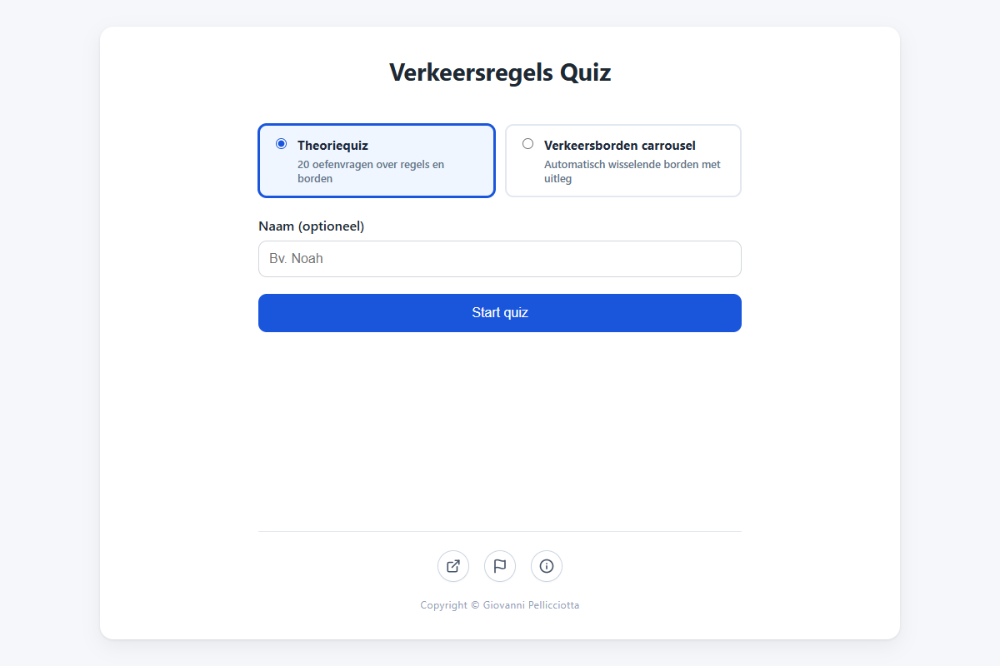
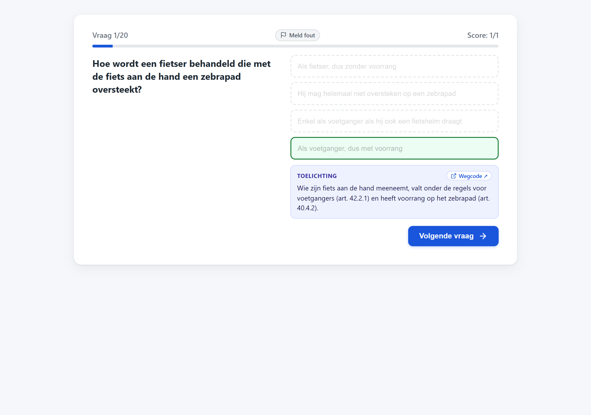
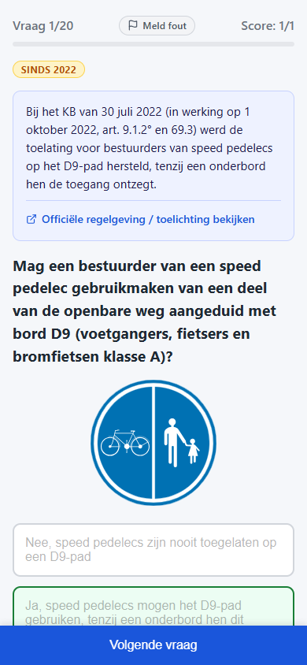
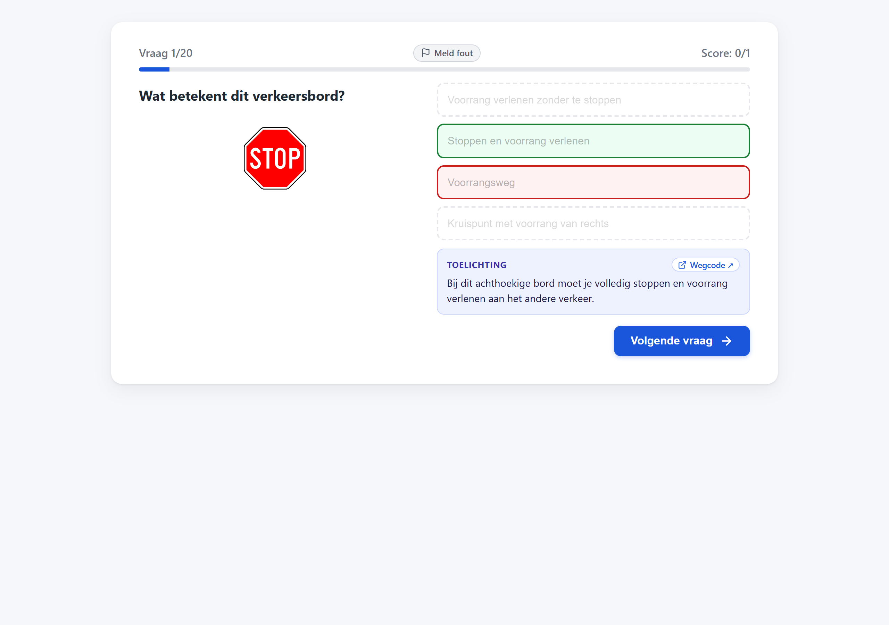
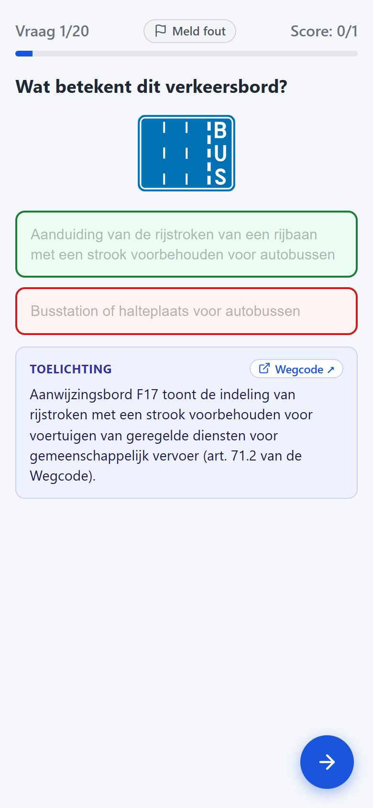
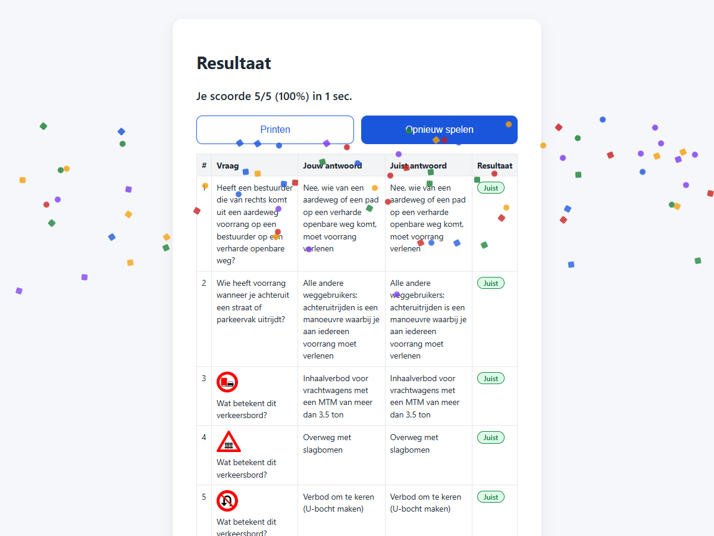
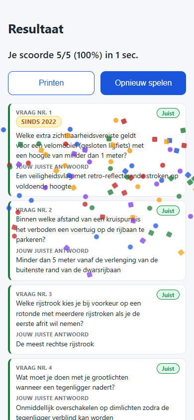
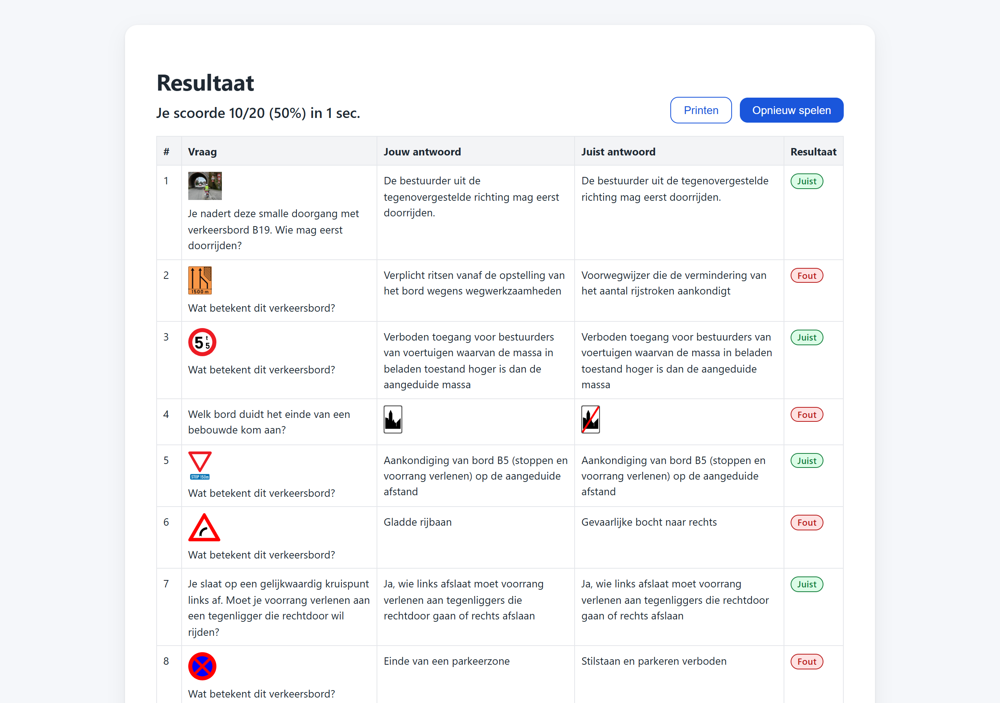
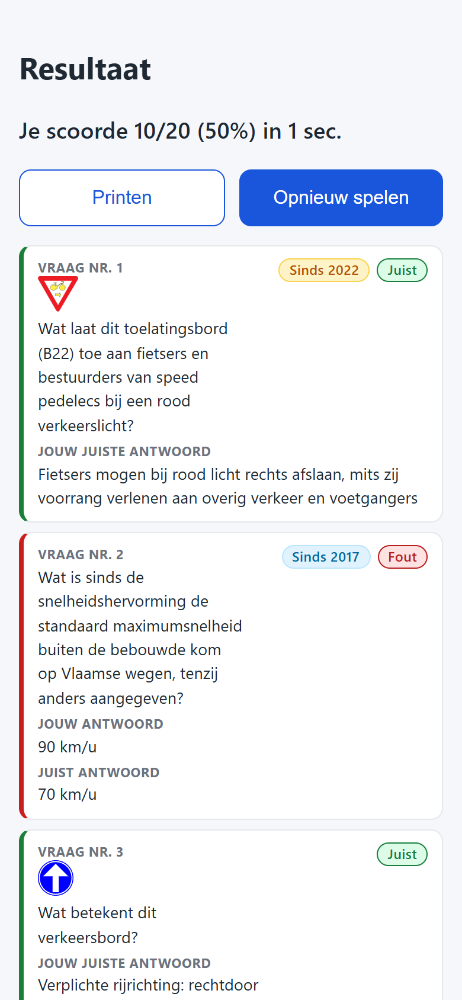

# Verkeers-regels Quiz

Een moderne webquiz om te oefenen voor het Belgische theoretisch rijexamen (Categorie B).
Geen server vereist: statische HTML/CSS/JS, direct te hosten via GitHub Pages en 100% offline bruikbaar als PWA.

## Hoe spelen

- Op het startscherm kies je tussen twee modi: "Start quiz" of "Bekijk carrousel".
- Vul optioneel je naam in om scores en rondetijden bij te houden.
- In quizmodus krijg je een reeks willekeurige vragen (standaard 20, aanpasbaar via URL-parameters).
- Vragen bestaan uit verkeersborden herkennen, borden aanduiden bij omschrijvingen, verkeersregels en echte verkeerssituaties met foto's.
- Na elk antwoord zie je direct feedback, inclusief wetsartikel en een directe `Wegcode ↗` link.
- Zie je een fout of onduidelijkheid? Klik op de knop "Meld fout" om direct een opmerking door te geven.
- Op het einde krijg je je score, rondetijd en een gedetailleerd review-overzicht dat je kan printen.
- Onderaan het startscherm vind je drie iconen met tooltips:
  - Externe link naar de geconsolideerde wegcode op wegcode.be.
  - Link naar GitHub Issues om opmerkingen of fouten te melden.
  - Info-knop (`ℹ`) die het scherm met versiegeschiedenis, release notes en bronnen opent.

## Visuele rondleiding

Een overzicht van de quiz-interface op desktop en mobiele apparaten:

### Startscherm

| Desktop                                                      | Mobiel                                                     |
|--------------------------------------------------------------|------------------------------------------------------------|
|  |  |

### Vraag met juist antwoord

| Desktop                                                                    | Mobiel                                                                   |
|----------------------------------------------------------------------------|--------------------------------------------------------------------------|
|  |  |

### Vraag met fout antwoord

| Desktop                                                                 | Mobiel                                                                |
|-------------------------------------------------------------------------|-----------------------------------------------------------------------|
|  |  |

### Resultaten met confetti (perfecte score)

| Desktop                                                                             | Mobiel                                                                            |
|-------------------------------------------------------------------------------------|-----------------------------------------------------------------------------------|
|  |  |

### Resultaten zonder confetti

| Desktop                                                                                   | Mobiel                                                                                  |
|-------------------------------------------------------------------------------------------|-----------------------------------------------------------------------------------------|
|  |  |

## URL-parameters

De applicatie ondersteunt optionele parameters in de URL:

- `?s=YYYY` (aliassen: `?sinds=YYYY`, `?since=YYYY`): filtert de vragenpool op regels ingevoerd vanaf het jaartal (bv. `?s=2022`).
- `?q=N` (alias: `?quantity=N`): stelt het aantal vragen per ronde in (standaard 20, bv. `?q=10`).
- `?mode=carousel`: start direct de verkeersborden-carrouselmodus.
- `?speed=N`: wisselduur per bord in seconden tijdens carrouselmodus (standaard 5, bv. `?speed=3`).
- `?pause=1`: start de carrousel in gepauzeerde toestand.
- `?view=about` (alias: `?about=1`): opent direct de Over deze app-weergave met versiegeschiedenis en bronnen.
- `?autostart=1`: start direct een quizronde zonder naam in te vullen.

Vragen over recente wetswijzigingen (binnen 5 jaar) dragen een amberkleurige "Sinds YYYY" badge.
Oudere wetswijzigingen tonen een blauwe badge.

## Lokaal uittesten

Vanuit de projectmap:

```bash
python -m http.server 8000
```

Open dan [http://localhost:8000/index.html](http://localhost:8000/index.html) in de browser.

## Vragenbank aanpassen

De vragen staan in [data/questions.json](data/questions.json), zie
[data/SOURCES.md](data/SOURCES.md) voor de gebruikte bronnen en verkeersbord-afbeeldingen.
De vragenbank telt momenteel 304 geverifieerde vragen. Elke vraag heeft een `type`:
- `recognize` — toont een verkeersbord (`sign`), 4 tekstopties als mogelijke betekenis.
- `identify` — toont een omschrijving, 4 bord-afbeeldingen als opties.
- `rule` — vraag over een verkeersregel, 4 tekstopties (toont optioneel een bord via `sign`).
- `situation` — toont een foto van een verkeerssituatie (`image`), 4 opties over voorrang of rijgedrag.

Verkeersborden staan in `assets/signs/` (193 SVG-bestanden).
Situatiefoto's staan in `assets/situations/` (20 JPEG-bestanden).

## Deployen naar GitHub Pages

1. Maak een GitHub-repository aan en push deze projectmap ernaartoe.
2. Ga naar Settings > Pages, kies branch `main` en map `/ (root)`.
3. Na een minuut is de site live op `https://<gebruikersnaam>.github.io/<repo-naam>/`.

Werkt met JavaScript zonder probleem: GitHub Pages is gewoon statische bestandshosting.

## Scores opslaan in een Google Sheet (optioneel)

1. Maak een nieuwe Google Sheet aan.
2. Ga naar Extensies > Apps Script, en plak de inhoud van
   [google-apps-script/Code.gs](google-apps-script/Code.gs) in het script-editorvenster.
3. Klik op Deployen > Nieuwe implementatie > type "Web app".
   - "Uitvoeren als": jouw account.
   - "Toegang": Iedereen.
4. Kopieer de gegenereerde web-app-URL.
5. Plak die URL als waarde van `SHEET_WEBAPP_URL` bovenaan in [js/config.js](js/config.js).
6. Elke afgeronde quiz voegt automatisch een rij toe aan het tabblad "Resultaten" van de Sheet
   (datum, naam, score, aantal vragen, percentage en tijdsduur).

Zolang `SHEET_WEBAPP_URL` op `null` staat, wordt dit gewoon overgeslagen — de quiz werkt ook
zonder deze stap.

### Rechten van het script

`Code.gs` bevat de annotatie `/** @OnlyCurrentDoc */`. Daardoor vraagt Google bij het autoriseren
enkel toegang tot deze ene gekoppelde Sheet (`spreadsheets.currentonly`), niet tot al je Google
Sheets. Als je het script al had geautoriseerd voordat deze annotatie werd toegevoegd, deed je dat
met de bredere toegang. Om dat recht te laten intrekken en te vervangen door de vernauwde versie:

1. Plak de bijgewerkte inhoud van `Code.gs` opnieuw in de script-editor en sla op.
2. Ga naar Deployen > Implementaties beheren > potlood-icoon > Versie: Nieuwe versie > Implementeren.
   Dit houdt dezelfde web-app-URL, maar draait de nieuwe (vernauwde) code.
3. Ga naar [myaccount.google.com/permissions](https://myaccount.google.com/permissions), zoek het
   script-project op en verwijder de bestaande toegang.
4. Doorloop de quiz opnieuw zodat het script opnieuw om toestemming vraagt — controleer dan of de
   vraag nu specifiek over "deze spreadsheet" gaat, niet over "al je spreadsheets".

### Gedeeld geheim tegen spam

`Code.gs` en `js/config.js` delen een `sleutel`-waarde (`SHARED_SECRET` / `CONFIG.SHEET_SECRET`) die
moet overeenkomen voor er een rij wordt toegevoegd. Dit is geen echte beveiliging — de waarde staat
gewoon leesbaar in de publieke broncode — maar houdt generieke bots tegen die lukraak Apps
Script-URL's aanschieten. Wijzig je de waarde in het ene bestand, wijzig ze dan ook in het andere
en herdeploy het script (zie vorige sectie, stap 2).

### Foutmeldingen opslaan in tabblad "Meldingen"

Spelers kunnen tijdens elke vraag op "Meld fout" klikken om een opmerking door te geven.
Het script maakt automatisch een apart tabblad "Meldingen" aan met de volgende kolommen:

- `Wanneer`: tijdstip van melding in ISO-formaat.
- `Vraag ID`: unieke identifier van de vraag.
- `Vraag`: volledige tekst van de vraag.
- `Wie`: spelersnaam of "Anoniem" als er geen naam werd ingevuld.
- `Opmerking`: toelichting of voorgestelde correctie van de speler.

### Testen of de Sheet-koppeling werkt

1. Open de site en doorloop de quiz volledig tot het resultatenscherm.
2. Open de Google Sheet: er moet een tabblad "Resultaten" verschenen zijn met een nieuwe rij
   (datum, naam, score, totaal, percentage, duur in seconden en geformatteerde duur).
3. Zie je geen rij verschijnen, open dan de browserconsole (F12 > Console) tijdens het spelen —
   een mislukte aanroep logt daar een waarschuwing "Kon score niet naar Google Sheet sturen".
4. Wil je het los van de UI testen: open in de Apps Script-editor het menu Uitvoeringen
   (Executions, links in de zijbalk) na een testoproep, dat toont de laatste `doPost`-aanroepen
   en eventuele foutmeldingen.

## Open vragen / vervolgstappen

- Vragenbank uitbreiden met meer categorieën naarmate er tijd is.
- Overwegen om her-antwoorden van foutieve vragen als extra oefenronde toe te voegen.
