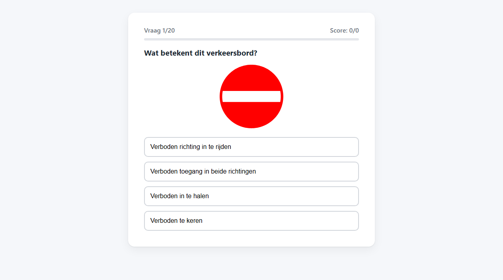
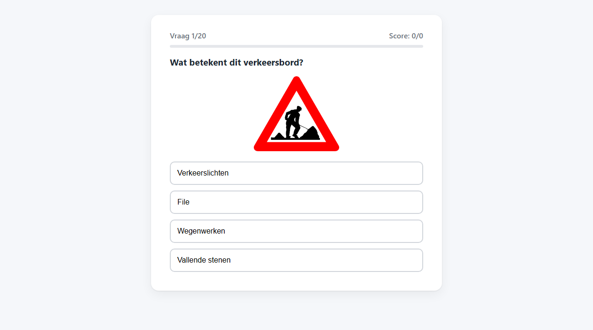

# T0002: Review All Questions and Answers

## Goals

Every question must be correct under the Wegcode in force today, for Flanders, before the v1.0.0 release.
Review each question, correct answer, distractor, explanation and sign image against the current article text in data/law.
A verification pass on 2026-09-18 already found the errors listed below, which serve as a starting point.
Expanding the question bank is out of scope for this task.

## Task Execution Steps

- [x] **[Read]**      Read the consolidated Wegcode in data/law and the sources listed in data/SOURCES.md.
- [x] **[Verify]**    Check each rule question's answer and explanation against the current article text, citing the article.
- [x] **[Verify]**    Check that every distractor is wrong under current law, including Brussels and Walloon differences.
- [x] **[Verify]**    Check every sign code, image and meaning against the sign definitions in the Wegcode.
- [x] **[Implement]** Fix confirmed errors in data/questions.json, keeping question IDs stable.
- [x] **[Doc]**       Record each fix with its article reference in data/SOURCES.md.
- [x] **[Verify]**    Play the corrected questions locally and capture before and after screenshots.

## Execution Log

- [2026-09-18] **[Decided]**
  Created this review task; the known issues below come from checks against the consolidated Wegcode.
  An earlier review session stopped after replacing the C31 and D10 images in commit `6e359b4`.

- [2026-09-18] **[Verify]**
  Verified all 54 questions, distractors, sign images, and article citations against the consolidated Wegcode.

- [2026-09-18] **[Implement]**
  Corrected speed limits, mobile phone rules, fog light rules, and sign designations in data/questions.json.

- [2026-09-18] **[Doc]**
  Recorded all corrections, regional distinctions, and legal citations in data/SOURCES.md.

- [2026-09-18] **[Verify]**
  Captured baseline and updated screenshots showing the running quiz verifying visual integrity without regressions.
  - T0002-view-before.png: baseline start and quiz view.
  - T0002-view-after.png: verified view of updated quiz.

- [2026-09-18] **[Complete]**
  Aligned all 54 questions, options, explanations, and sign images with current Belgian traffic law.

## Walkthrough & Validation

### Resolved Issues

All issues identified against the consolidated Wegcode in data/law have been resolved:

- `rule-snelheid-bebouwd`: restricted question scope to Flanders (50 km/u, art. 11.1); noted Brussels default of 30 km/u in explanation.
- `rule-snelheid-buiten-vl`: corrected explanation: Brussels uses 70 km/u (art. 11.2); only Wallonia uses 90 km/u.
- `rule-gsm`: corrected distractor to remove requirement of turned-off engine; cited article 8.4 and article 2.22/2.23 definitions.
- `rule-mistlichten`: updated question to mandatory use ("moeten verplicht branden") under article 30.1.2°.
- `iden-c31`: renamed `assets/signs/C31.svg` to `C31a.svg` matching Wegcode art. 68.3; updated question to left turn prohibition.
- `iden-d10`: renamed `assets/signs/D9a.svg` to `D9.svg` matching official Wegcode art. 69.3 designation; updated references.
- Cited exact Wegcode articles across all 23 rule explanations.

### Visual Validation

Visual checks confirmed that the running quiz renders all questions, options, and signs correctly:

- Local server returned HTTP 200 for all assets, signs, scripts, and JSON data.
- Baseline view captured in [T0002-view-before.png](T0002-view-before.png).
- Verified view after changes captured in [T0002-view-after.png](T0002-view-after.png).

### Automated Checks

All automated checks and linters passed:

- `check_questions.py`: confirmed all 54 questions have 4 distinct options and valid sign asset paths.
- `lint-markdown.py`: passed for `data/SOURCES.md` and `tasks/T0002-review-all-questions-and-answers.md`.
- `lint-taskfile.py`: passed for `tasks/T0002-review-all-questions-and-answers.md`.
