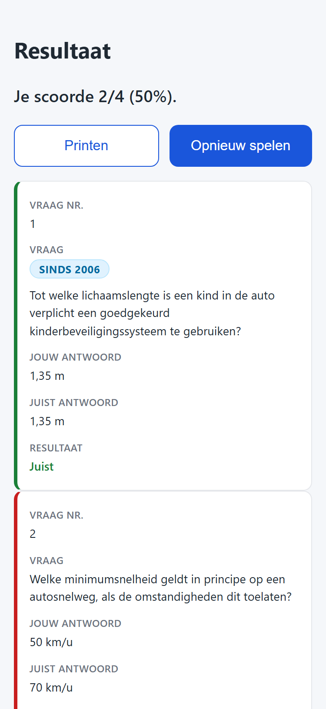
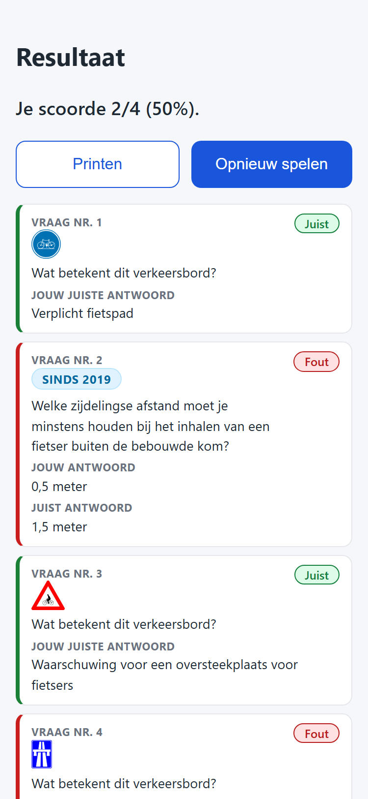

# T0004: Condense Mobile Result Cards

## Goals

Improve the mobile results layout to make question cards more compact and readable.
Place pill badges for correctness in the card top-right corner.
Combine question number and title into a single concise header.
Merge user and correct answer fields when answered correctly into one row.
Reduce vertical card gaps to condense the overall results screen.

## Task Execution Steps

- [x] **[Read]**      Inspect existing mobile results styles and markup in css/style.css and js/app.js.
- [x] **[Implement]** Combine question numbering with question text in results card rendering.
- [x] **[Implement]** Merge user answer and correct answer into a single field for correct responses.
- [x] **[Implement]** Style correctness tags as top-right pill badges with condensed spacing.
- [x] **[Verify]**    Capture mobile before and after screenshots demonstrating condensed layout.
- [x] **[Doc]**       Record visual walkthrough and validation findings in the task file.

## Execution Log

- [2026-09-18] **[Decided]**
  Created task to condense mobile result cards with top-right pill badges and merged fields.

- [2026-09-18] **[Read]**
  Inspected existing results rendering in js/app.js and mobile card styles in css/style.css.

- [2026-09-18] **[Implement]**
  Combined question numbering into question headers and merged correct answers into Jouw Juiste Antwoord.
  - Omitted redundant correct answer row for correct results on mobile.
  - Added semantic column classes for robust responsive and print styling.

- [2026-09-18] **[Implement]**
  Styled correctness indicators as top-right pill badges and condensed mobile card spacing.
  - Reduced vertical margins and padding to create compact question cards.
  - Added 8px card separation gap and preserved full tabular print styling.

- [2026-09-18] **[Verify]**
  Captured mobile before and after screenshots demonstrating condensed layout and verified desktop compatibility.
  - T0004-view-before.png: baseline mobile results screen showing verbose cards.
  - T0004-view-after.png: condensed mobile results screen showing pill badges.

- [2026-09-18] **[Doc]**
  Documented mobile result card layout changes and visual comparisons in the task file.

- [2026-09-18] **[Complete]**
  Delivered condensed mobile result cards with top-right pill badges and unified answer fields.

## Walkthrough & Validation

### Changes Made

- `js/app.js`: updated `showResult` to add semantic column classes (`col-num`, `col-question`, `col-user-ans`, `col-correct-ans`, `col-result`), combine question numbering into `data-label="Vraag Nr. ${i + 1}"`, merge correct user answers into `data-label="Jouw Juiste Antwoord"`, and render `.badge-result` elements.
- `css/style.css`: styled `.badge-result` (`.badge-result-correct`, `.badge-result-wrong`) as pill-shaped badges (`border-radius: 9999px`, padding `2px 10px`).
- `css/style.css`: updated `@media screen and (max-width: 639px)` to hide `.col-num`, hide `.col-correct-ans` when `correct-row`, position `.col-result` as a top-right badge, reduce card vertical padding to `8px 12px`, and set an `8px` vertical gap (`margin-bottom: 8px`) between cards.
- `css/style.css`: reinforced `@media print` rules to ensure full tabular display is preserved across all viewports.

### Visual Validation

Visual checks across mobile and desktop viewports confirmed:

- **Vertical gap**: clear 8px vertical separation between cards on mobile.
- **Top-right pill badge**: "Juist" and "Fout" badges rendered as compact pills at the top-right corner of each card.
- **Combined question header**: "Vraag Nr. ###" displayed directly above question content without a separate number row.
- **Unified answer on correct responses**: single "Jouw Juiste Antwoord" field shown on correct cards with redundant answer row omitted.
- **Detailed wrong responses**: "Jouw antwoord" and "Juist antwoord" both preserved on incorrect cards for learning.
- **Desktop & Print compatibility**: clean 5-column table display maintained on desktop and in print view.

### Automated Checks

- Markdown linting: passed via `lint-markdown.py`.
- Taskfile linting: passed via `lint-taskfile.py`.
