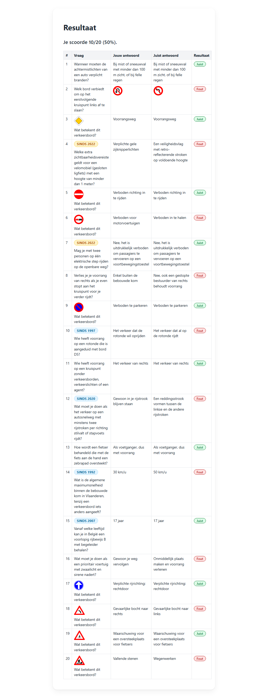
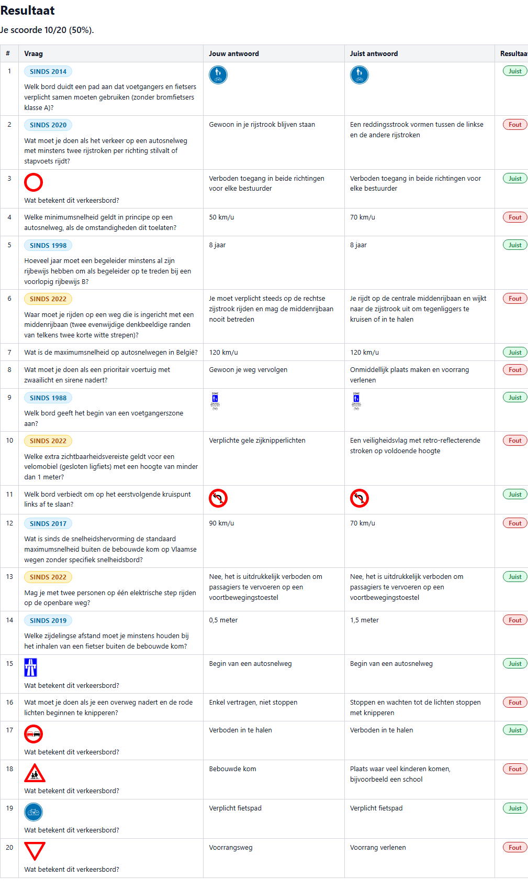

# T0005: Full Width and Unsplit Print Results

## Goals

Ensure the quiz results page prints cleanly across full paper width.
Prevent result table rows from splitting awkwardly across multiple printed pages.
Repeat table headers automatically across page breaks.
Hide non-printable UI elements and optimize font sizes and margins for print.

## Task Execution Steps

- [x] **[Read]**      Inspect print styles in css/style.css and test print rendering in headless browser.
- [x] **[Implement]** Expand print layout width to use full paper width in css/style.css.
- [x] **[Implement]** Prevent table rows from splitting across pages using CSS page break rules.
- [x] **[Implement]** Ensure table headers repeat cleanly on subsequent printed pages.
- [x] **[Verify]**    Verify full-width unsplit print rendering using PDF and print emulation screenshots.
- [x] **[Doc]**       Record print verification results and screenshot evidence in the task file.

## Execution Log

- [2026-09-18] **[Decided]**
  Created task to ensure full-width print results and prevent table rows from splitting across pages.

- [2026-09-18] **[Read]**
  Inspected print stylesheet rules in css/style.css and captured baseline print media emulation screenshot.

- [2026-09-18] **[Implement]**
  Expanded printable body, app container, result screen, and result table to full width without box shadows.
  - Configured standard page margins via `@page`.
  - Enforced exact color printing for badges.

- [2026-09-18] **[Implement]**
  Added page break avoidance rules to prevent table rows and cells from splitting across pages.
  - Configured repeating table headers across pages.
  - Set compact padding and crisp borders.

- [2026-09-18] **[Verify]**
  Verified full-width unsplit layout using Chrome CDP print emulation and generated a three-page print PDF.
  - Confirmed headers repeat on subsequent pages.
  - Confirmed rows never split across pages.

- [2026-09-18] **[Doc]**
  Documented print styles and visual validation evidence in the task file.

- [2026-09-18] **[Complete]**
  Delivered full-width unsplit print results page with repeating headers and exact color printing.

## Walkthrough & Validation

### Changes Made

- `css/style.css`: configured `@page { size: auto; margin: 12mm 15mm; }` for standard printable paper margins.
- `css/style.css`: expanded `body`, `#app`, `#screen-result`, and `#result-table` to `100%` width with `padding: 0`, `margin: 0`, and removed container card shadows and border radii in `@media print`.
- `css/style.css`: enforced strict tabular display (`display: table !important`, `table-layout: auto !important`, `border-collapse: collapse !important`).
- `css/style.css`: enabled automatic repeating table headers across printed pages with `thead { display: table-header-group !important; }`.
- `css/style.css`: prevented table rows and cells from breaking across pages with `break-inside: avoid !important` and `page-break-inside: avoid !important` on `tr` and `td`/`th`.
- `css/style.css`: preserved badge colors and contrast in print output via `print-color-adjust: exact` and `-webkit-print-color-adjust: exact`.

### Visual Validation

Visual checks using Chrome DevTools Protocol print emulation confirmed:

- **Full width**: the results summary and table expand across the entire available page width instead of being constrained to 620px.
- **Unsplit table rows**: each row remains intact on a single page, avoiding awkward page cuts across question text or answers.
- **Repeating table header**: table column headers repeat at the top of each subsequent printed page.
- **Pill badge and color preservation**: "Juist" and "Fout" badges retain colored borders and backgrounds.
- **Crisp typography and spacing**: table cells use compact padding and clean borders for paper printouts.

### Automated Checks

- Markdown linting: passed via `lint-markdown.py`.
- Taskfile linting: passed via `lint-taskfile.py`.
