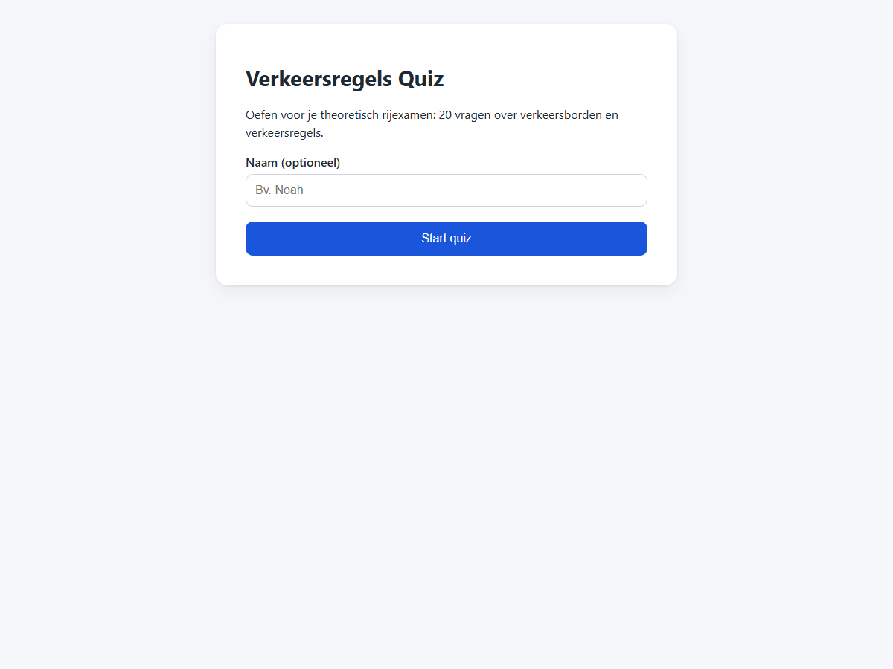
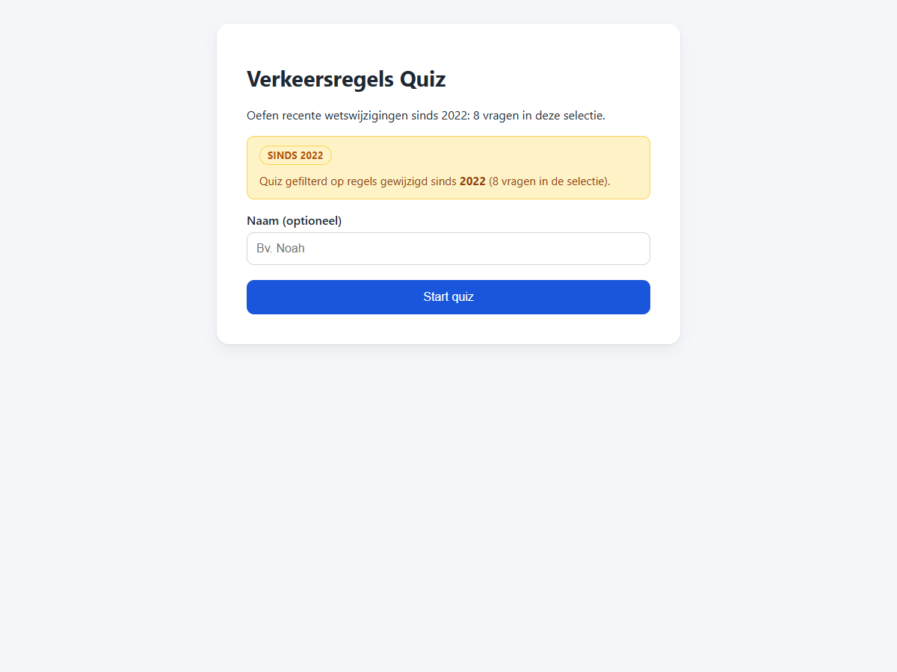
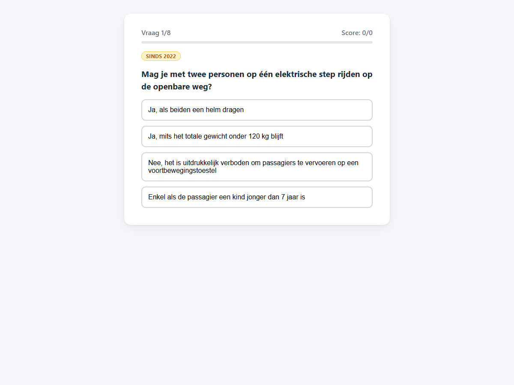
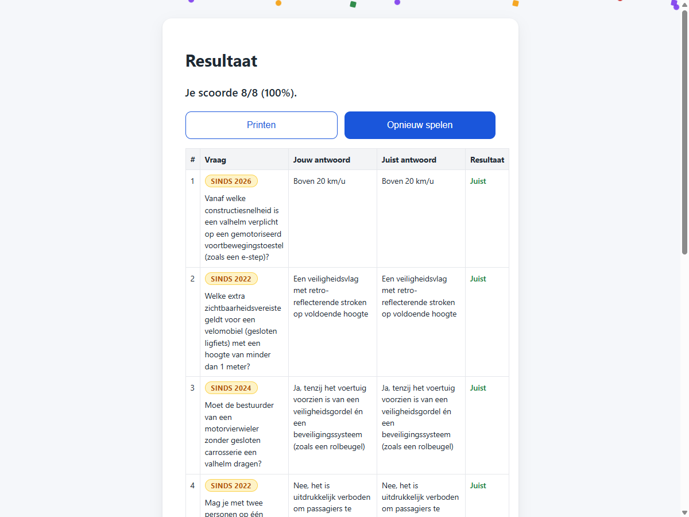

# T0006: Mark Recent Wegcode Amendments and Filter by Year

## Goals

Mark questions relating to recent Wegcode amendments with visual year badges.
Display amber badges for changes within the last five years and blue or no badges for older rules.
Support URL query filtering via since to practice newly introduced road rules exclusively.
Ensure questions data, quiz presentation, and results views clearly reflect amendment years.

## Task Execution Steps

- [x] **[Read]**      Review amending acts in data/law to identify introduction years for each question.
- [x] **[Implement]** Add since year metadata to questions in data/questions.json with legal citations.
- [x] **[Implement]** Render amber badges for recent amendments and optional blue badges for older rules.
- [x] **[Implement]** Support filtering questions using the since query parameter in app.js.
- [x] **[Verify]**    Verify year filtering and badge rendering in desktop and mobile views with screenshots.
- [x] **[Doc]**       Document the since metadata and filter parameter in README.md and task files.

## Execution Log

- [2026-09-18] **[Decided]**
  Created this task to tag questions by amendment year and allow focused practice on recent rules.

- [2026-09-18] **[Read]**
  Reviewed all amendment acts in data/law to identify the exact introduction year for every quiz question.

- [2026-09-18] **[Implement]**
  Added since year metadata to questions and authored nine new questions for recent Wegcode amendments.
  - Added questions for 2021, 2022, 2024, and 2026 amendments with citations.
  - Annotated seventeen historical questions with verified introduction years.

- [2026-09-18] **[Implement]**
  Added amber and blue badge styles and implemented URL query filtering by year in app.js.

- [2026-09-18] **[Doc]**
  Documented the since parameter and year badges in README.md and updated data/SOURCES.md.

- [2026-09-18] **[Verify]**
  Captured baseline and updated screenshots across desktop and mobile views verifying badge rendering and filtering.
  - T0006-view-before.png: baseline start screen view.
  - T0006-view-after.png: filtered start screen view.

- [2026-09-18] **[Complete]**
  Delivered amendment year badges and since query filtering for focused Wegcode practice.

## Walkthrough & Validation

### Changes Made

- `data/questions.json`: annotated 17 existing questions with `since` metadata and added 9 questions covering 2021-2026 Wegcode amendments.
- `css/style.css`: added pill-shaped `.badge-amber` and `.badge-blue` styles, `.filter-notice`, and `.table-question-wrap`.
- `js/app.js`: supported `?since=YYYY` URL parameter filtering, start screen notices, quiz question badges, and result table badges.
- `README.md`: documented the `?since=YYYY` and `?q=N` query parameters and the year badge system.
- `data/SOURCES.md`: updated the question bank count to 63 and recorded citations for all new amendment questions.

### Visual Validation

Visual checks on desktop and mobile confirmed that badges and filtering work as expected:

- Start screen with `?since=2022` displays an amber "Sinds 2022" badge and question count notice.
- Active quiz screen renders the amber badge prominently above the question text.
- Result table displays amber badges for recent amendments (<= 5 years) and blue badges for older rules.
- Mobile view renders cards cleanly with badges under the question header.

### Automated Checks

- Question validation: verified 63 questions with unique IDs, 4 options, valid asset paths, and correctIndex bounds.
- Filtering check: verified `?since=2026` (1 question), `?since=2024` (2 questions), `?since=2022` (8 questions), and `?since=2021` (10 questions).
- Markdown linting: passed for `README.md`, `data/SOURCES.md`, and this task file.
- Taskfile linting: passed for this task file.
