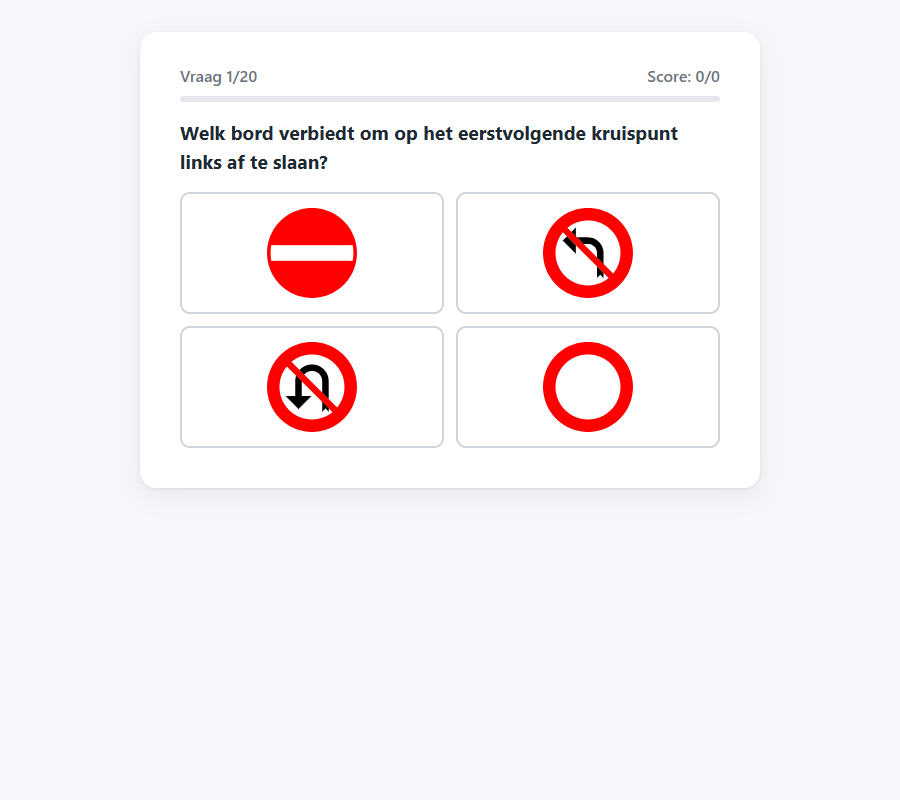
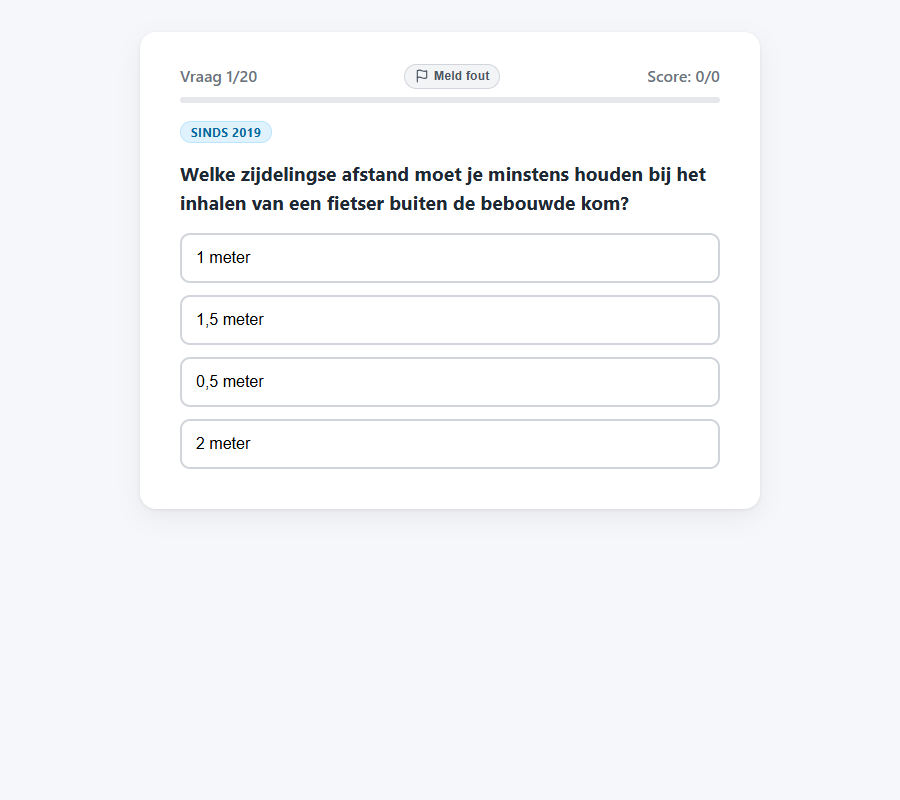
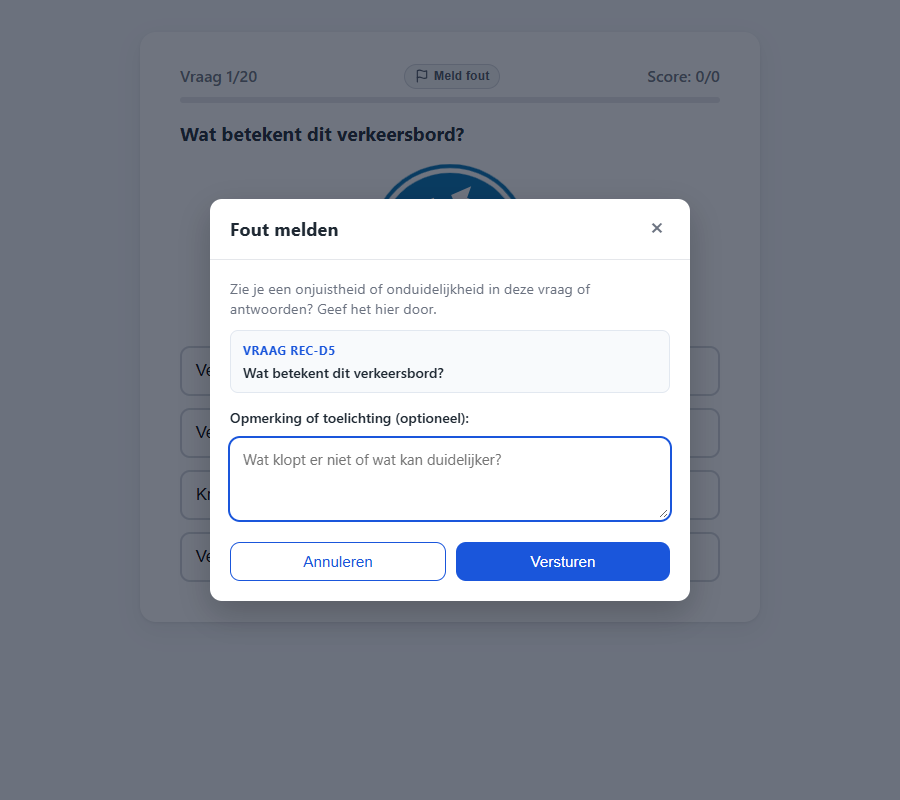
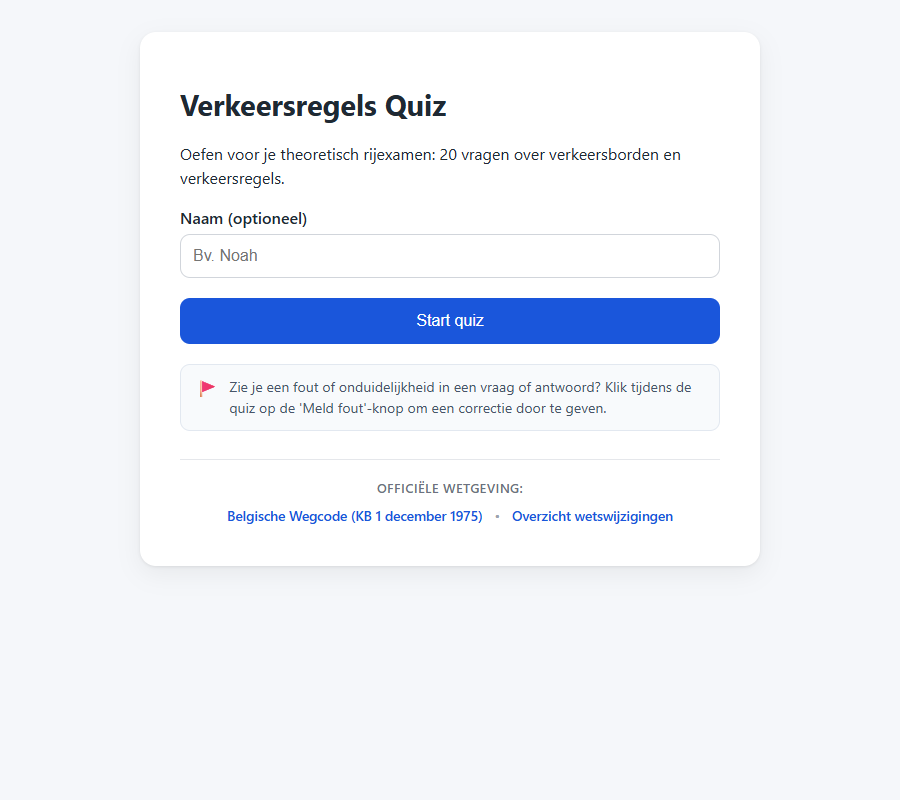

# T0007: Report Question Error to Google Sheet

## Goals

Enable players to report errors or ambiguities directly from any quiz question screen.
Store question error reports in a dedicated Meldingen tab in the Google Sheet.
Explain the error reporting button and icon on the quiz start page.
Provide a clean, unobtrusive reporting modal with immediate feedback.

## Task Execution Steps

- [x] **[Read]**      Inspect question screen layout in index.html and Google Apps Script handling in Code.gs.
- [x] **[Implement]** Add a report error button on each quiz question screen in index.html and app.js.
- [x] **[Implement]** Add an explanatory note on the start screen detailing how to report question errors.
- [x] **[Implement]** Handle error reporting submissions in app.js and store in Meldingen tab in Code.gs.
- [x] **[Verify]**    Verify error reporting modal flow and start screen explanation with before and after screenshots.
- [x] **[Doc]**       Document error reporting workflow in README.md and record validation in the task file.

## Execution Log

- [2026-09-18] **[Decided]**
  Created task to enable question error reporting directly from the quiz to a separate Google Sheet tab.

- [2026-09-18] **[Read]**
  Inspected question screen layout in index.html and Google Apps Script handling in Code.gs.

- [2026-09-18] **[Implement]**
  Added start screen explanation box detailing the question error reporting feature and flag button.

- [2026-09-18] **[Implement]**
  Added report button in the quiz header and designed a clean question error reporting modal.
  - Added backdrop overlay, question summary, remark textarea, and confirmation message.
  - Implemented keyboard and backdrop dismiss triggers.

- [2026-09-18] **[Implement]**
  Implemented report error webhook submissions in app.js and dedicated Meldingen tab logging in Code.gs.

- [2026-09-18] **[Verify]**
  Verified modal interaction flow and captured baseline, updated quiz, modal, and start screen screenshots.
  - T0007-view-before.png: baseline quiz screen without report button.
  - T0007-view-after.png: quiz screen with header report button.
  - T0007-modal.png: question error report modal open.
  - T0007-start-view.png: start screen explanation box.

- [2026-09-18] **[Doc]**
  Documented question error reporting and Google Sheet Meldingen tab structure in README.md.

- [2026-09-18] **[Complete]**
  Delivered question error reporting button, modal interaction flow, and Google Sheet Meldingen tab storage.

## Walkthrough & Validation

### Changes Made

- `index.html`: added report explanation callout on `#screen-start`, added `#btn-report-error` to quiz header, and added `#modal-report` dialog.
- `css/style.css`: added styles for `.start-report-hint`, `.btn-report-error`, and the responsive modal dialog; excluded modal from print media.
- `js/app.js`: wired modal open/close interactions, dismiss handlers, remark input, and asynchronous submission to Google Apps Script.
- `google-apps-script/Code.gs`: added `report_error` action branch appending question feedback rows to the `Meldingen` sheet tab.
- `README.md`: documented error reporting in the gameplay instructions and detailed the `Meldingen` sheet columns.
- `CHANGELOG.md`: recorded release note under `v1.0.0-pre`.

### Visual Validation

Visual checks on desktop and automated browser runs confirmed that reporting works cleanly:

- Start screen shows explanation box with flag icon and guidance for reporting errors.
- Active quiz screen displays the "Meld fout" button in the header between progress and score.
- Clicking the button opens the modal displaying the current question ID, text, and remark field.
- Submitting displays the confirmation notice "Bedankt voor je melding!" and automatically closes the dialog.

### Automated Checks

- End-to-end browser tests: verified opening modal, cancelling via button, closing via Escape key, filling remark, and submitting POST payload.
- Payload verification: confirmed `actie`, `sleutel`, `datum`, `vraagId`, `vraag`, `naam`, and `opmerking` fields sent correctly.
- Markdown linting: passed for `README.md`, `CHANGELOG.md`, and this task file.
- Taskfile linting: passed for this task file.
