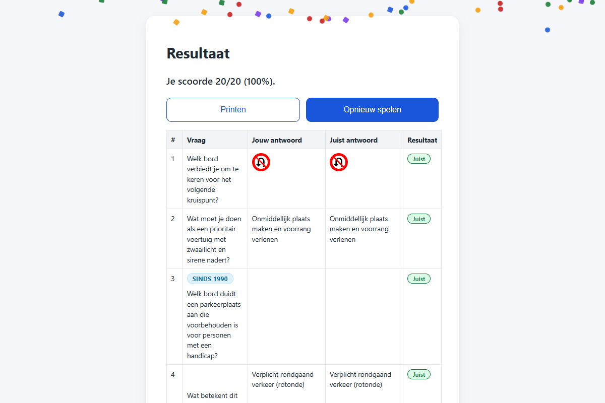
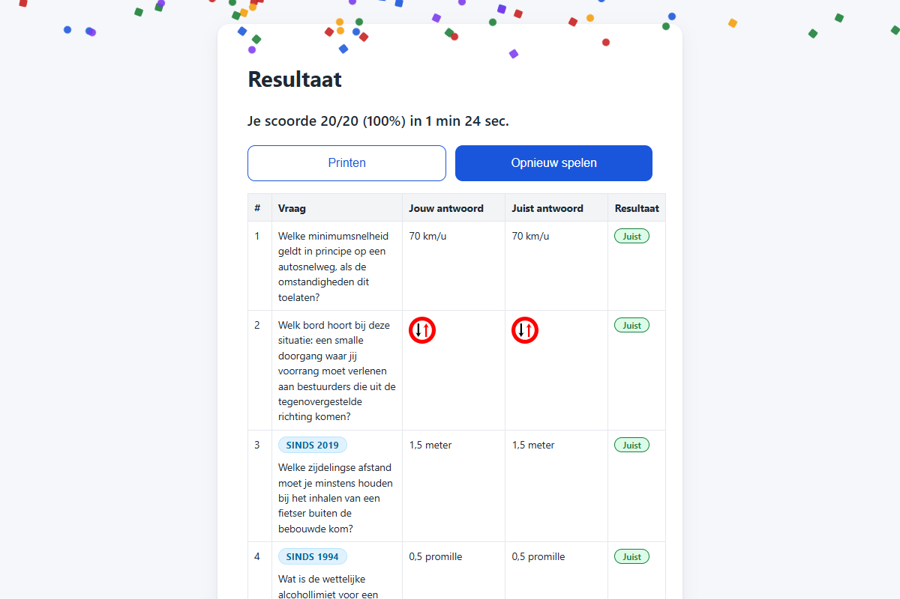

# T0008: Track Quiz Duration

## Goals

Track total elapsed time from starting the quiz to viewing results.
Display the completed duration cleanly on the results screen and in printouts.
Transmit the duration to the Google Sheet backend alongside the player score.
Update the Google Apps Script handler to persist duration records.

## Task Execution Steps

- [x] **[Read]**      Inspect quiz lifecycle in js/app.js and sheet endpoint in google-apps-script/Code.gs.
- [x] **[Implement]** Track quiz start and completion timestamps in state and format elapsed duration.
- [x] **[Implement]** Display the elapsed quiz duration on the results screen in index.html and app.js.
- [x] **[Implement]** Send duration in sheet payload and update google-apps-script/Code.gs headers and row values.
- [x] **[Verify]**    Verify duration tracking and payload submission with before and after screenshots.
- [x] **[Doc]**       Document duration tracking in README.md and record validation in the task file.

## Execution Log

- [2026-09-18] **[Decided]**
  Created task to measure quiz duration, display it on results screen, and store it in Google Sheet.

- [2026-09-18] **[Read]**
  Inspected quiz lifecycle in js/app.js and sheet append logic in google-apps-script/Code.gs.

- [2026-09-18] **[Implement]**
  Added timestamp tracking, duration calculation, and Dutch formatDuration formatting helper to app.js.
  - Added startTime, endTime, and durationSeconds properties to state object.
  - Formatted elapsed duration string in Dutch minutes and seconds.

- [2026-09-18] **[Implement]**
  Updated results screen summary and sheet payload with quiz duration metrics.
  - Displayed elapsed duration in result-summary on the results view.
  - Appended Duur (sec) and Duur columns in google-apps-script/Code.gs.

- [2026-09-18] **[Verify]**
  Captured baseline and updated screenshots confirming duration display on the results screen.
  - T0008-view-before.png: baseline results screen without duration.
  - T0008-view-after.png: updated results screen showing formatted duration.

- [2026-09-18] **[Doc]**
  Documented duration tracking and Google Sheet columns in README.md and updated task validation.

- [2026-09-18] **[Complete]**
  Delivered quiz duration tracking on results screen and Google Sheet storage.

## Walkthrough & Validation

### Changes Made

- `js/app.js`: added `startTime`, `endTime`, and `durationSeconds` to `state`, recorded start timestamp in `startQuiz()`, implemented `formatDuration()` helper, updated `showResult()` to show duration, and included `duur` and `duur_tekst` in `submitToSheet()`.
- `google-apps-script/Code.gs`: expanded sheet headers to include `Duur (sec)` and `Duur`, and appended `p.duur` and `p.duur_tekst` row values.
- `README.md`: documented elapsed duration visibility on results screen and updated Google Sheet column documentation.
- `CHANGELOG.md`: recorded product change under `v1.0.0-pre`.

### Visual Validation

Visual checks on desktop confirmed that the results screen displays the formatted duration properly:

- Baseline view shows results summary without duration (`Je scoorde 20/20 (100%).`).
- After view shows results summary with formatted duration (`Je scoorde 20/20 (100%) in 1 min 24 sec.`).

### Automated Checks

- Helper validation: verified `formatDuration()` across unit test cases (e.g. 1 sec, 45 sec, 1 min, 1 min 24 sec, 2 min, 2 min 5 sec, 60 min).
- Markdown linting: passed for `README.md`, `CHANGELOG.md`, and this task file.
- Taskfile linting: passed for this task file.
