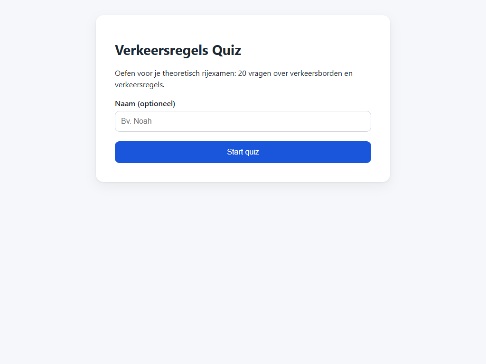
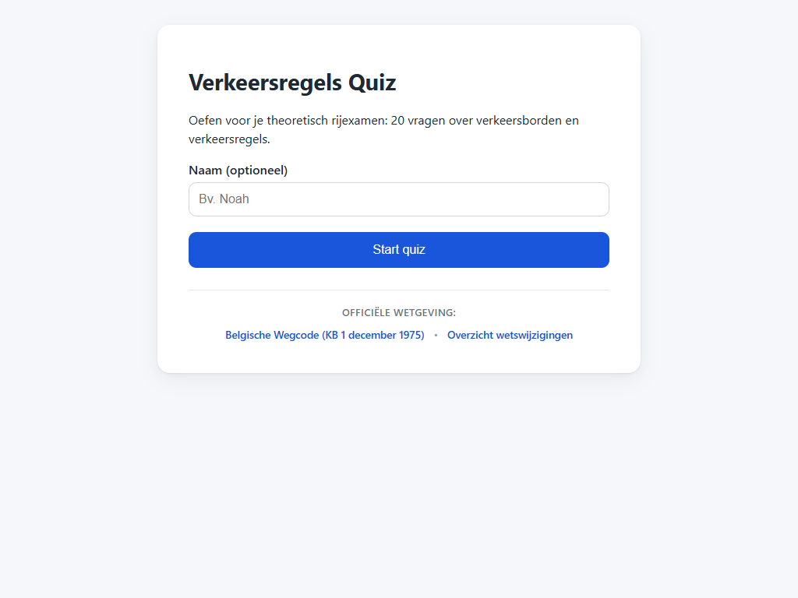

# T0009: Add Wegcode Links on Home Page

## Goals

Add links on the home page pointing players to official Wegcode legal sources.
Provide direct links to the consolidated Wegcode on wegcode.be and the amendment ledger.
Integrate the links seamlessly into the start screen layout without cluttering mobile viewports.
Ensure external links open safely in a new tab with proper security attributes.

## Task Execution Steps

- [x] **[Read]**      Identify canonical Wegcode URLs from data/law/README.md and review home screen markup.
- [x] **[Implement]** Add a legal sources section with links to wegcode.be on the start screen.
- [x] **[Implement]** Style the legal links cleanly for desktop and mobile viewports in css/style.css.
- [x] **[Verify]**    Verify links work correctly and capture home screen screenshots before and after.
- [x] **[Doc]**       Document the home screen links and visual validation findings in the task file.

## Execution Log

- [2026-09-18] **[Decided]**
  Created task to link to the official consolidated Wegcode and amendments from the home page.

- [2026-09-18] **[Read]**
  Identified official consolidated Wegcode and amendment ledger URLs from legal source documentation.

- [2026-09-18] **[Implement]**
  Added start screen footer containing secured external links to the consolidated Wegcode and amendments.

- [2026-09-18] **[Implement]**
  Styled start screen legal links with subtle muted colors and responsive layout for mobile screens.

- [2026-09-18] **[Verify]**
  Verified HTTP 200 responses and captured before and after screenshots of the home screen.
  - T0009-view-before.png: baseline start screen view.
  - T0009-view-after.png: updated start screen view.

- [2026-09-18] **[Complete]**
  Added official Wegcode legal links to the start screen with responsive styling and security attributes.

## Walkthrough & Validation

### Changes Made

- `index.html`: added `.start-legal-links` footer to `#screen-start` with secure links to the official Wegcode and amendment ledger.
- `css/style.css`: added styles for `.start-legal-links`, muted header, and responsive column stacking below 640px.

### Visual Validation

Visual checks on desktop and mobile confirmed that legal links render cleanly without clutter:

- Baseline view before changes captured in [T0009-view-before.png](T0009-view-before.png).
- Updated view with legal links captured in [T0009-view-after.png](T0009-view-after.png).
- Local web server returned HTTP 200 for all quiz assets.
- Both external links include `target="_blank"` and `rel="noopener noreferrer"`.

### Automated Checks

- Linters passed: `lint-markdown.py` and `lint-taskfile.py` verified the task documentation.
- Link attributes: confirmed `target="_blank"` and `rel="noopener noreferrer"` on all links.
