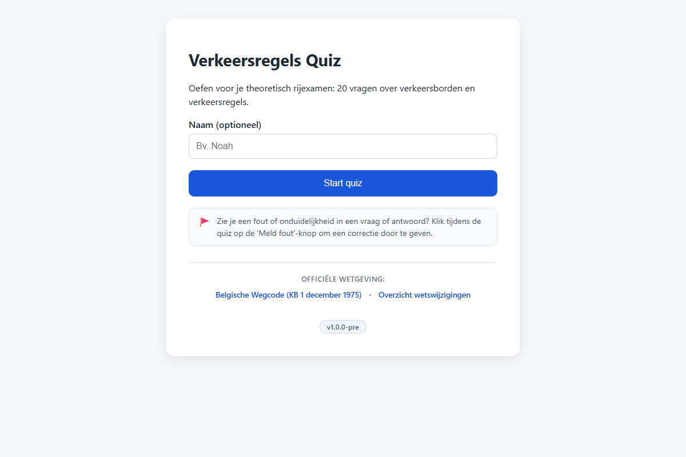
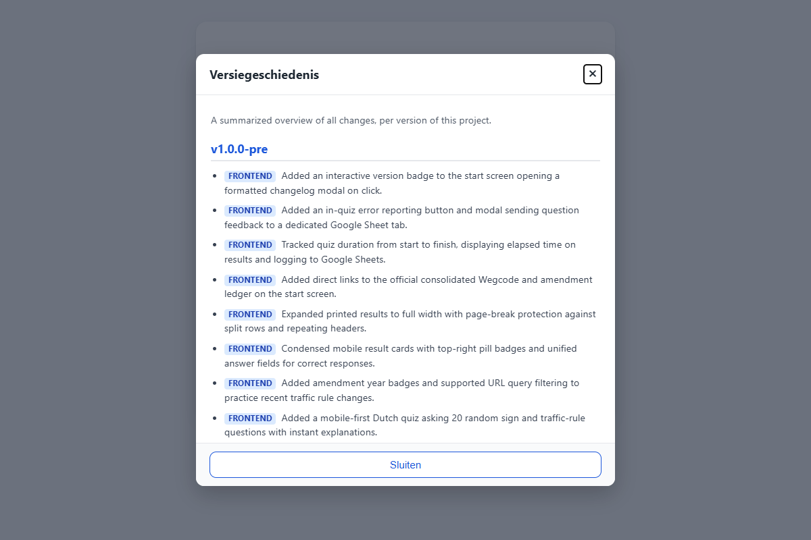

# T0010: Show Version and Changelog

## Goals

Display the application version on the quiz start screen.
Make the version indicator interactive so clicking it displays the project changelog.
Render changelog entries cleanly in an accessible modal dialog.
Ensure the version and changelog view look great across desktop and mobile devices.

## Task Execution Steps

- [x] **[Read]**      Inspect start screen markup and determine changelog fetching or rendering approach.
- [x] **[Implement]** Add a clickable version indicator to the start screen in index.html.
- [x] **[Implement]** Build an accessible modal to display formatted changelog notes on click.
- [x] **[Implement]** Style version badge and changelog modal cleanly in css/style.css.
- [x] **[Verify]**    Verify version display and changelog modal interaction with before and after screenshots.
- [x] **[Doc]**       Document version display in README.md and record validation in the task file.

## Execution Log

- [2026-09-18] **[Decided]**
  Created task to display the app version on the start screen and show the CHANGELOG on click.

- [2026-09-18] **[Read]**
  Reviewed start screen markup, existing modal patterns, and changelog structure to design the viewer.

- [2026-09-18] **[Implement]**
  Added a version button to the start screen footer and built the modal changelog dialog.

- [2026-09-18] **[Implement]**
  Styled the version pill button and changelog modal with smooth scrolling and responsive typography.

- [2026-09-18] **[Implement]**
  Implemented changelog fetching, semantic markdown parsing, category badges, and keyboard dismiss handling.

- [2026-09-18] **[Verify]**
  Verified modal interaction flows and captured baseline, updated start, and modal screenshots.
  - T0010-view-before.png: baseline start screen view.
  - T0010-view-after.png: start screen with version badge.
  - T0010-modal.png: changelog modal dialog open.

- [2026-09-18] **[Doc]**
  Documented the version indicator and changelog modal viewer in README.md and updated CHANGELOG.md.

- [2026-09-18] **[Complete]**
  Delivered start screen version display and accessible interactive changelog modal viewer.

## Walkthrough & Validation

### Changes Made

- `js/app.js`: configured version string, wired dynamic badge text, implemented markdown parser with category badges, and added modal open/close listeners.
- `index.html`: added version badge button `#btn-version` to `#screen-start` footer and added accessible dialog `#modal-changelog`.
- `css/style.css`: styled `.btn-version` as an interactive pill badge, styled `.modal-dialog-changelog` with scrolling body and badges, and excluded modal from print.
- `README.md`: documented version indicator, changelog modal interaction, and `?modal=changelog` query parameter.
- `CHANGELOG.md`: added release note bullet under `v1.0.0-pre`.

### Visual Validation

Visual checks on desktop confirmed clean layout and smooth modal interactions:

- Baseline start screen view captured in [T0010-view-before.png](T0010-view-before.png).
- Updated start screen with version badge captured in [T0010-view-after.png](T0010-view-after.png).
- Interactive changelog modal captured in [T0010-modal.png](T0010-modal.png).
- Local web server returned HTTP 200 for all quiz assets.
- Verified dismissal via Close button, Sluiten button, backdrop click, and Escape key.

### Automated Checks

- End-to-end tests: verified automated Playwright interactions opening modal, parsing changelog, and testing all dismiss mechanisms.
- Linters passed: verified documentation and task file formatting with dev-guidelines scripts.
