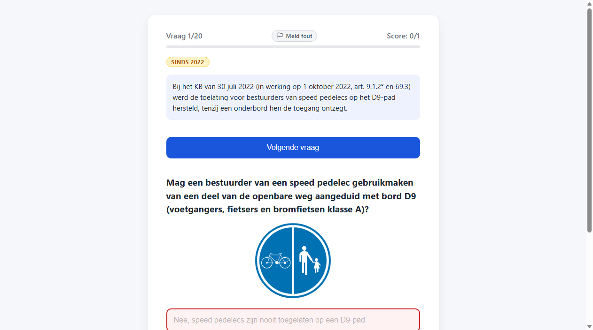
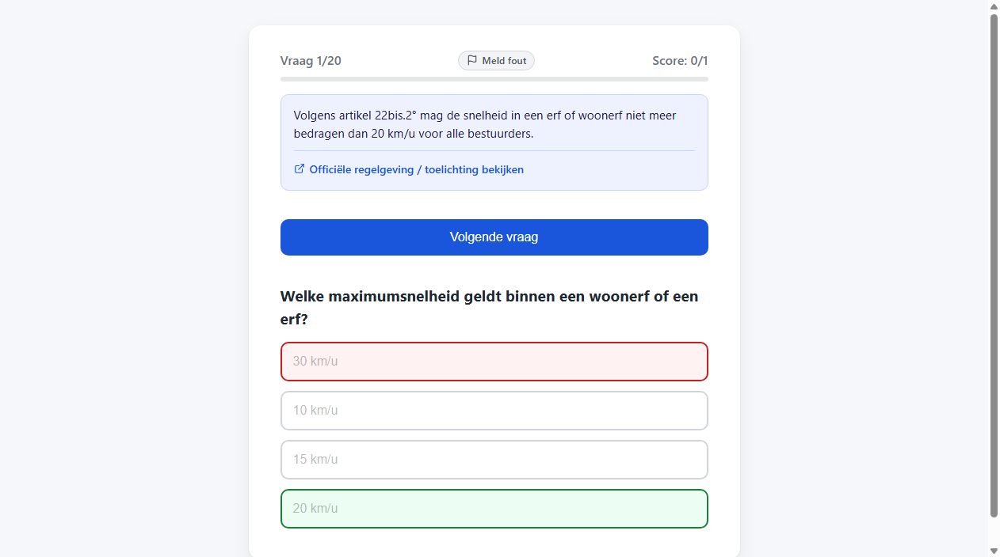
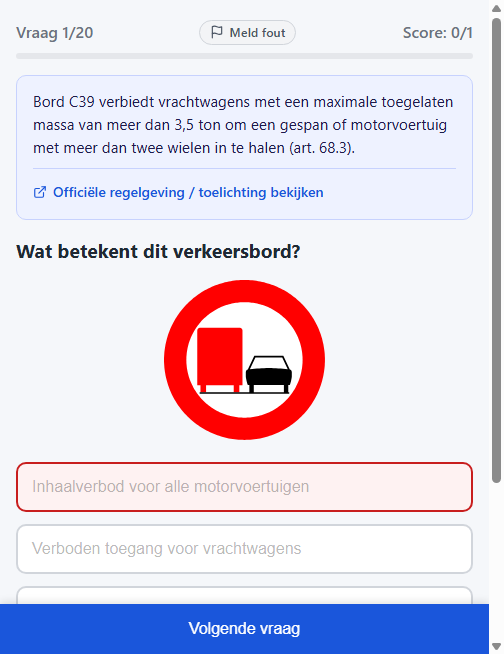

# T0013: Show Question Links When Answered

## Goals

Provide an authoritative reference link for each quiz question to the official Wegcode rule or explainer site.
Ensure the link is displayed clearly in the UI once the user has selected an answer.
Style the reference link cleanly with accessible contrast and responsive placement on mobile and desktop.
Update questions in data/questions.json with valid, verified URLs for all sign and rule questions.
Verify visual rendering and test suite integrity across the updated quiz.

## Task Execution Steps

- [x] **[Read]**      Inspect question rendering logic in js/app.js and existing sources in data/questions.json.
- [x] **[Implement]** Ensure every question in data/questions.json contains a valid authoritative source URL.
- [x] **[Implement]** Render an accessible external reference link below the question explanation in js/app.js.
- [x] **[Implement]** Style the question reference link and hover states responsively in css/style.css.
- [x] **[Verify]**    Verify link rendering, URL validity, and capture before and after visual screenshots.
- [x] **[Doc]**       Update data documentation and record task validation and walkthrough details.

## Execution Log

- [2026-09-18] **[Decided]**
  Claimed task to display authoritative rule and explainer links upon answering each question.

- [2026-09-18] **[Read]**
  Inspected question rendering logic, stylesheet rules, and existing source references across questions.

- [2026-09-18] **[Implement]**
  Populated authoritative consolidated Wegcode links across all sign questions and updated test assertions.

- [2026-09-18] **[Implement]**
  Rendered accessible reference links below question explanations and styled responsive interactive states.

- [2026-09-18] **[Verify]**
  Verified automated unit tests and captured visual before, after, and mobile screenshots.
  - T0013-view-before.png: baseline question view before reference link rendering.
  - T0013-view-after.png: desktop question view displaying official reference link.
  - T0013-view-mobile.png: mobile question view displaying responsive link layout.

- [2026-09-18] **[Doc]**
  Updated requirements, question bank source notes, and changelog records with link details.

## Walkthrough & Validation

### Changes Made

- `data/questions.json`: added authoritative consolidated Wegcode links for all 47 sign questions.
- `js/app.js`: implemented `renderExplanation` with safe DOM link creation and external icon.
- `css/style.css`: styled `.explanation`, `.explanation-text`, `.explanation-source`, and `.explanation-link`.
- `tests/test_quiz_data.py`: added `test_all_questions_have_valid_source_url` and required source field checks.
- `docs/requirements.md`: documented instant question source links and 126 questions catalog count.
- `data/SOURCES.md`: documented consolidated Wegcode article sources for all traffic signs.
- `README.md`: noted official rule links in the gameplay summary.
- `CHANGELOG.md`: added entry under `v1.1.0-pre`.

### Visual Validation

Visual checks on desktop and mobile confirmed clear link rendering and responsive layouts:

- Baseline question view captured in [T0013-view-before.png](T0013-view-before.png).
- Desktop question view with link captured in [T0013-view-after.png](T0013-view-after.png).
- Mobile responsive layout captured in [T0013-view-mobile.png](T0013-view-mobile.png).
- Local web server returned HTTP 200 for all quiz assets.
- Links include `target="_blank"`, `rel="noopener noreferrer"`, and explicit focus styling.

### Automated Checks

- Ran `python -m unittest discover tests` passing all 9 tests in 0.06s.
- Validated all 126 question URLs with HTTP 200 responses.
