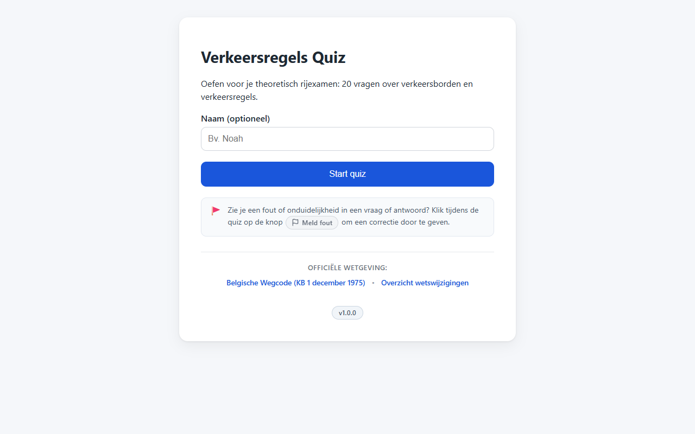

# T0014: Release v1.1.0

## Goals

Release version 1.1.0 of the Belgian traffic rules quiz.
Finalize version strings across application configuration and UI badges.
Freeze version 1.1.0 release notes in the changelog and open the next development cycle.
Verify all automated tests, linters, and documentation assets for the release build.

## Task Execution Steps

- [x] **[Read]**      Review release requirements, active changelog bullets, and version locations in the codebase.
- [x] **[Implement]** Update application version to v1.1.0 in js/app.js and index.html.
- [x] **[Doc]**       Finalize v1.1.0 in CHANGELOG.md and create next active v1.1.1-pre heading.
- [x] **[Verify]**    Run test suites, markdown linters, and capture version badge screenshots.
- [x] **[Verify]**    Run deployment pre-flight verification script to confirm release readiness.
- [x] **[Doc]**       Record release completion and integration evidence in the task log.

## Execution Log

- [2026-09-18] **[Decided]**
  Claimed task T0014 to cut the v1.1.0 production release.

- [2026-09-18] **[Read]**
  Reviewed version occurrences across configuration, HTML markups, test suites, and changelog release notes.

- [2026-09-18] **[Implement]**
  Updated CONFIG.VERSION to v1.1.0 in js/app.js and bumped the start screen version badge in index.html.

- [2026-09-18] **[Doc]**
  Finalized release notes for v1.1.0 in CHANGELOG.md and created the active v1.1.1-pre heading.

- [2026-09-18] **[Verify]**
  Captured before and after screenshots of the start screen confirming the version badge transition.
  - T0014-view-before.png: baseline start screen showing v1.0.0.
  - T0014-view-after.png: updated start screen showing v1.1.0.

- [2026-09-18] **[Verify]**
  Ran automated pytest suite passing 9 of 9 tests and executed deployment pre-flight checks.

- [2026-09-18] **[Complete]**
  Released version 1.1.0 with finalized version identifiers, changelog freeze, and passing verification checks.

## Walkthrough & Validation

### Changes Made

- `js/app.js`: updated `CONFIG.VERSION` to `v1.1.0`.
- `index.html`: updated start screen version badge button text to `v1.1.0`.
- `CHANGELOG.md`: finalized `## v1.1.0 [2026-09-18]` and opened `## v1.1.1-pre`.
- `tasks/T0014-view-before.png`: baseline start screen screenshot showing `v1.0.0` version badge.
- `tasks/T0014-view-after.png`: updated start screen screenshot showing `v1.1.0` version badge.
- `tasks/T0014-release-v1-1-0.md`: documented release steps, verification evidence, and completion log.

### Visual Validation

Visual checks on the start screen confirmed the version badge transition:

- Baseline start screen view with `v1.0.0` captured in [T0014-view-before.png](T0014-view-before.png).
- Updated start screen view with `v1.1.0` captured in [T0014-view-after.png](T0014-view-after.png).
- Local web server returned HTTP 200 for all quiz assets.




### Automated Verification

Executed test suite and CLI tooling end-to-end:

```bash
# Automated question data, schema, and sign validation
python -m pytest tests/
# 9 passed in 0.09s, exit code 0

# Cross-platform bootstrap script
python scripts/bootstrap-dev-environment.py
# Exit code 0 (Success)

# Deployment pre-flight script CLI checks
python scripts/deploy-to-production.py --version
# deploy-to-production v1.1.0 - Copyright (c) 2026 Giovanni Pellicciotta (exit code 0)

python scripts/deploy-to-production.py --help
# Displays usage, options, and exit codes (exit code 0)

# Taskfile and markdown linters
python C:\Dev-Projects\dev-guidelines\scripts\lint-taskfile.py tasks/T0014-release-v1-1-0.md
python C:\Dev-Projects\dev-guidelines\scripts\lint-markdown.py CHANGELOG.md tasks/T0014-release-v1-1-0.md
```
