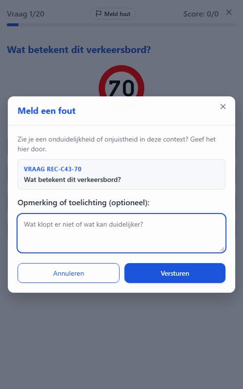
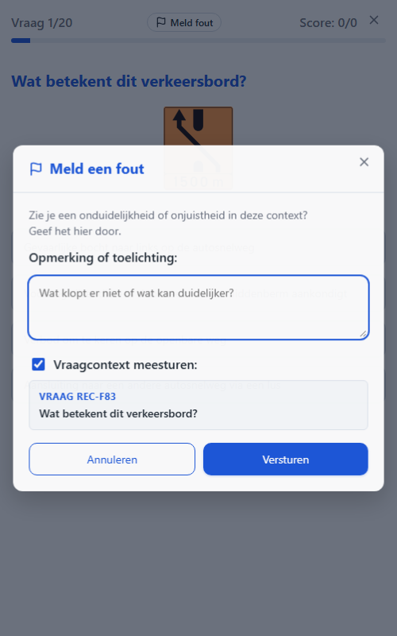
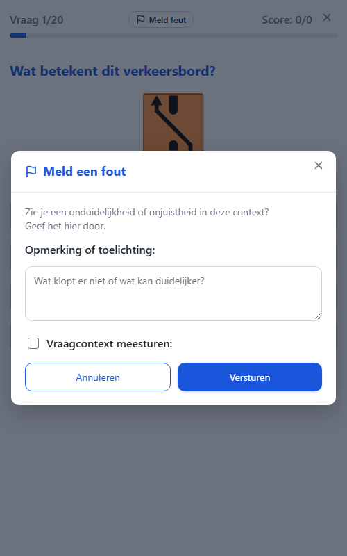

# T0064: Improve the Meld een Fout Modal Dialog

## Goals

Improve the "Meld een fout" (report an error) modal dialog's layout and copy.
Add the report icon at the start of the modal title, next to the close icon.
Lead the form with the remark textarea and drop the "(optioneel)" qualifier from its label.
Move the question-context box beneath the remark box, gated by a new "include context" checkbox.
Split the two-sentence intro description onto two separate lines in every supported language.

## Task Execution Steps

- [x] **[Read]**      Inspect modal-report markup, i18n strings, and report-modal.js/report-queue.js.
- [x] **[Implement]** Add a title icon and split the intro description across two lines.
- [x] **[Implement]** Reorder the form and add the "include question context" checkbox toggle.
- [x] **[Implement]** Pass the checkbox state through to `submitErrorReport` to omit context when unchecked.
- [x] **[Implement]** Update remark label and add checkbox label strings across all five languages.
- [x] **[Verify]**    Run the Python test suite and visually verify the modal before and after.
- [x] **[Doc]**       Record validation results and screenshots in this task file.

## Execution Log

- [2026-09-22] **[Decided]**
  Claimed T0064 to restructure the report-error modal per the four requested layout changes.

- [2026-09-22] **[Read]**
  Inspected `index.html` modal-report markup, `js/report-modal.js`, `js/report-queue.js`, `js/dom.js`, and the `report.*` i18n keys.

- [2026-09-22] **[Implement]**
  Added a `report` flag icon before the modal title text and gave `.modal-desc` `white-space: pre-line`.
  - Split `report.description` and `report.description_offline` into two lines with an embedded `\n` in all 5 languages.

- [2026-09-22] **[Implement]**
  Reordered the form: remark label/textarea first, then a new "include context" checkbox, then the context box.
  - Removed "(optioneel)" from `report.label_remark` in all 5 languages.
  - Added `report.label_include_context` in all 5 languages, defaulting the checkbox to checked.
  - `toggleReportContextVisibility()` in `report-modal.js` shows/hides the context box on checkbox change.

- [2026-09-22] **[Implement]**
  `submitErrorReport(question, remark, includeContext)` in `report-queue.js` now omits `vraagId`/`vraag` when unchecked.

- [2026-09-22] **[Verify]**
  Ran `python -m pytest tests/ -q`: 114 passed, 8 subtests passed, no regressions.
  - Served the app locally (`python -m http.server`) and drove it with Playwright (`?mode=quiz&report=1`).
  - Confirmed no browser console errors and correct checkbox show/hide behavior.

- [2026-09-22] **[Doc]**
  Recorded validation results, screenshots, and review tier in this task file.

- [2026-09-22] **[Complete]**
  Delivered the restructured report-error modal with title icon, reordered fields, and optional context toggle.

## Walkthrough & Validation

### Changes Made

- `index.html`: wrapped the modal-report title in an icon span plus text span; reordered the form body to
  remark label/textarea, then the "include context" checkbox, then the (now `id`-tagged) question-context box.
- `css/style.css`: added `.modal-title-icon` and `.modal-checkbox-label` styles, and `white-space: pre-line`
  on `.modal-desc` so the two-sentence intro renders on separate lines.
- `js/dom.js`: added `modalQuestionSummary` and `reportIncludeContext` element references.
- `js/report-modal.js`: reset the checkbox to checked and the context box to visible on open; added
  `toggleReportContextVisibility()`; `handleReportSubmit` now reads the checkbox and forwards it.
- `js/report-queue.js`: `submitErrorReport` gained an `includeContext` parameter (default `true`) that
  omits the question id/text from the submitted payload when the checkbox is unchecked.
- `data/strings.{nl,en,de,fr,it}.json`: updated `report.label_remark`, added `report.label_include_context`,
  and split `report.description`/`report.description_offline` onto two lines.

### Visual Validation

Verified locally with a static HTTP server (`http.server`, HTTP 200) driven by Playwright at
`?mode=quiz&report=1`, viewport 500x800:

- Title now shows the report flag icon before "Meld een fout".
- Intro renders as two separate lines.
- "Opmerking of toelichting:" (no longer "(optioneel)") leads with its textarea.
- The "Vraagcontext meesturen:" checkbox, checked by default, precedes the visible context box.
- Unchecking the checkbox hides the context box immediately.

### Automated Checks

- `python -m pytest tests/ -q`: 114 passed, 8 subtests passed.
- Manual Playwright smoke test: no console errors on load or checkbox toggle.

### Review Tier

Solo AI agent, pre-authorized autonomous-loop integration: implementation, tests, and visual
verification all passed, so this task integrates directly per the coordination protocol.
