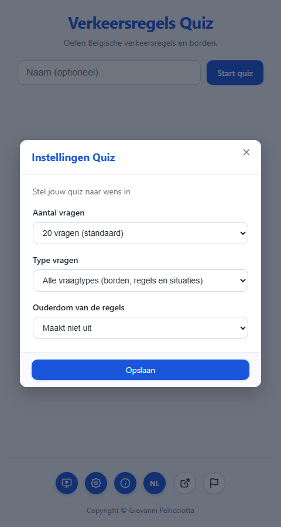
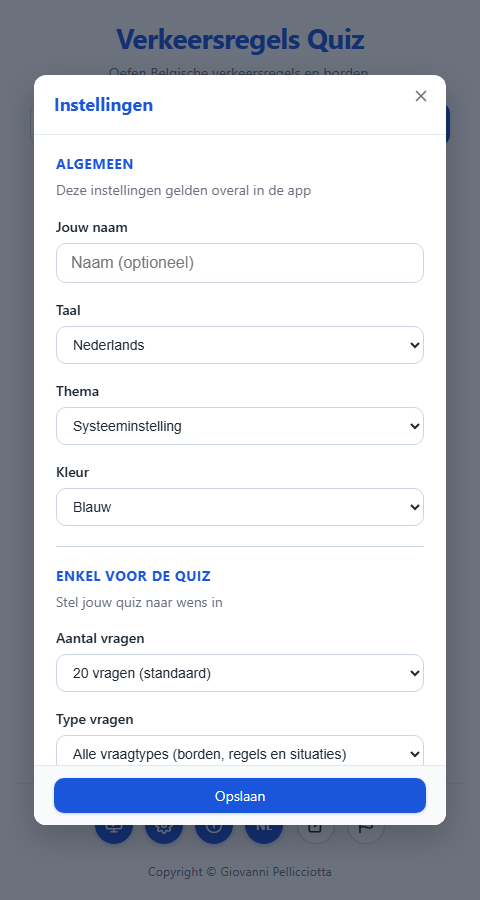
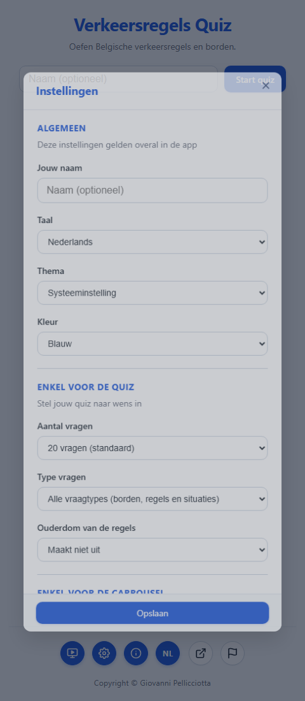

# T0065: Unify the Quiz and Carousel Settings Dialogs

## Goals

Merge the separate quiz-mode and carousel-mode settings dialogs into one unified dialog.
Add clearly labeled General/Quiz-only/Carousel-only sections so it is obvious which
settings apply where. Add UI in the General section for player name, interface language,
theme, and theme color, which previously could only be set via query parameters. Keep the
standalone language toggle button and existing query parameters working, and persist every
setting in `localStorage`, re-reading it on every load unless a query parameter overrides it.

## Task Execution Steps

- [x] **[Read]**      Inspect config-modal.js, preferences.js, theme.js, i18n.js, params.js, and dom.js.
- [x] **[Implement]** Add a General section (name, language, theme, theme color) to the settings modal.
- [x] **[Implement]** Show Quiz and Carousel sections unconditionally with clear section headings.
- [x] **[Implement]** Persist and restore theme/theme-color/name via the existing query-override-first pattern.
- [x] **[Implement]** Read stored theme in the pre-paint inline script to avoid a flash of the wrong theme.
- [x] **[Doc]**        Add/translate the new i18n keys across all five language files.
- [x] **[Verify]**     Run the Python test suite and visually verify the dialog and persistence in a browser.
- [x] **[Doc]**        Record validation results and screenshots in this task file.

## Execution Log

- [2026-09-22] **[Decided]**
  Claimed T0065 to unify the two settings dialogs into one, with General/Quiz/Carousel sections.

- [2026-09-22] **[Read]**
  Inspected `config-modal.js`, `preferences.js`, `theme.js`, `i18n.js`, `params.js`, `ui-mode.js`, `dom.js`,
  and `index.html`. Confirmed name/language/theme/theme-color previously had no settings-dialog UI at all.

- [2026-09-22] **[Decided]**
  Kept the existing "query param overrides stored preference" layering used by quiz/carousel settings and
  extended it to name/theme/theme-color, instead of inventing a different precedence rule for the new fields.

- [2026-09-22] **[Implement]**
  `index.html`: added a General section (name input, language/theme/theme-color selects) before the
  always-visible Quiz and Carousel sections; each section now has a labeled heading and a divider.
  Renamed the modal title key from `config.title_quiz`/`config.title_carousel` to a single `config.title`.

- [2026-09-22] **[Implement]**
  `js/params.js`: added `getThemeQueryOverride()`/`getThemeColorQueryOverride()` returning `null` when the
  query param is absent, used to guard when a stored preference may apply.
  - `js/preferences.js`: `applyStoredPreferences()` now reapplies stored theme/theme-color unless a query
    param overrides them.
  - `index.html`: the pre-paint inline script now falls back to `localStorage["verkeersquiz_preferences"]`
    for theme/theme-color before defaulting, preventing a flash of the wrong theme on reload.

- [2026-09-22] **[Implement]**
  `js/config-modal.js`: `openConfigModal()`/`saveConfig()` no longer branch on `state.currentMode`; they
  always populate and persist all three sections. Saving applies the theme immediately and, if the language
  changed, calls `setLang()` + `loadTranslations()` + `setStartMode()` + `loadChangelog()` (the same steps
  the standalone `btn-lang` toggle performs).
  - `js/dom.js`: registered `configName`/`configLanguage`/`configTheme`/`configThemeColor`.

- [2026-09-22] **[Doc]**
  Added `config.section_general/section_quiz/section_carousel`, `config.introduction_general`,
  `config.label_name/language/theme/theme_color`, and theme/color option strings to all 5 language files.
  Removed the now-unused `config.title_quiz`/`config.title_carousel` keys. Verified identical key sets
  across `strings.{nl,fr,de,it,en}.json` with a script.

- [2026-09-22] **[Verify]**
  Ran `python -m pytest tests/ -q`: 125 passed, 8 subtests passed (added `tests/test_unified_settings.py`
  and extended `tests/test_preferences_persistence.py`; updated 2 assertions in `tests/test_i18n.py` and
  `tests/test_minimal_start_screen.py` that hardcoded the old per-mode title).
  - Served the app locally (`python -m http.server`, HTTP 200) and drove it with Playwright: opened the
    dialog, changed name/theme/theme-color/quiz-count/carousel-delay, saved, and confirmed the values were
    written to `localStorage.verkeersquiz_preferences`, applied immediately (`data-theme`/`data-theme-color`
    attributes), and survived a full page reload with no query parameters. No console/page errors.

- [2026-09-22] **[Doc]**
  Recorded validation results, screenshots, and review tier in this task file.

- [2026-09-22] **[Complete]**
  Delivered one unified settings dialog with General/Quiz/Carousel sections; name, language, theme, and
  theme color are now settable in the UI and persisted in `localStorage`.

## Walkthrough & Validation

### Changes Made

- `index.html`: unified `#modal-config` into three always-visible sections (`config-section-general`,
  `config-section-quiz`, `config-section-carousel`), each with a `.config-section-title` heading; added
  `#config-name`, `#config-language`, `#config-theme`, `#config-theme-color`; the pre-paint theme script now
  reads `localStorage` as a fallback layer between query params and the `system`/`blue` defaults.
- `css/style.css`: added `.config-section-title`, `.config-section + .config-section` divider, `.config-input`.
- `js/params.js`: added `getThemeQueryOverride()` / `getThemeColorQueryOverride()`.
- `js/preferences.js`: `applyStoredPreferences()` restores theme/theme-color from storage unless overridden
  by a query param.
- `js/dom.js`: registered the four new General-section element refs.
- `js/config-modal.js`: rewritten to always read/write all three sections; saving applies the theme
  immediately and re-runs the language-switch pipeline when the language selection changed.
- `data/strings.{nl,fr,de,it,en}.json`: new/renamed `config.*` keys, kept in parity across all five files.
- `tests/`: extended `test_preferences_persistence.py`, added `test_unified_settings.py`, updated two
  hardcoded-title assertions in `test_i18n.py` and `test_minimal_start_screen.py`.

### Visual Validation

Verified locally with a static HTTP server (`http.server`, HTTP 200) driven by Playwright, viewport 480x900/1100:

- Unified dialog shows "ALGEMEEN" (name/language/theme/color), then "ENKEL VOOR DE QUIZ", then
  "ENKEL VOOR DE CARROUSEL", each separated by a divider — both mode-specific sections visible regardless
  of the current start-screen mode.
- Changing name, theme, theme color, quiz count, and carousel delay and clicking "Opslaan" immediately
  re-themes the page and persists every field to `localStorage.verkeersquiz_preferences`.
- Reloading the page with no query parameters restores the saved name, theme, and theme color.

### Automated Checks

- `python -m pytest tests/ -q`: 125 passed, 8 subtests passed.
- Manual Playwright smoke test: save → localStorage assertions → reload → restored-state assertions, all
  passed; no console/page errors.

### Review Tier

Solo AI agent, pre-authorized autonomous-loop integration: implementation, tests, and visual verification
all passed, so this task integrates directly per the coordination protocol.
