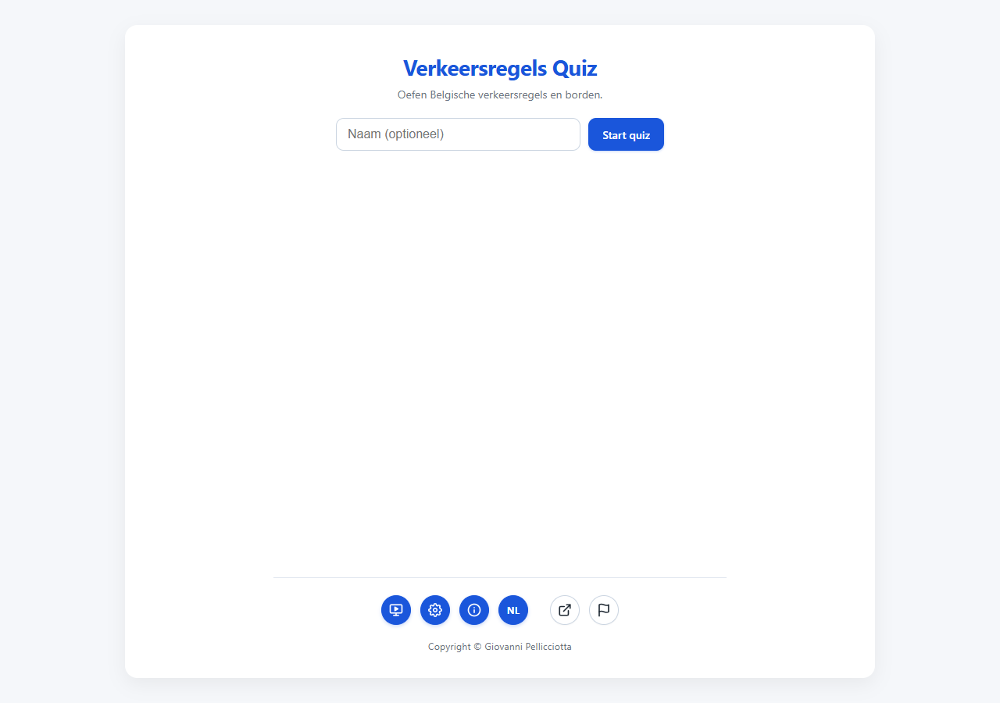
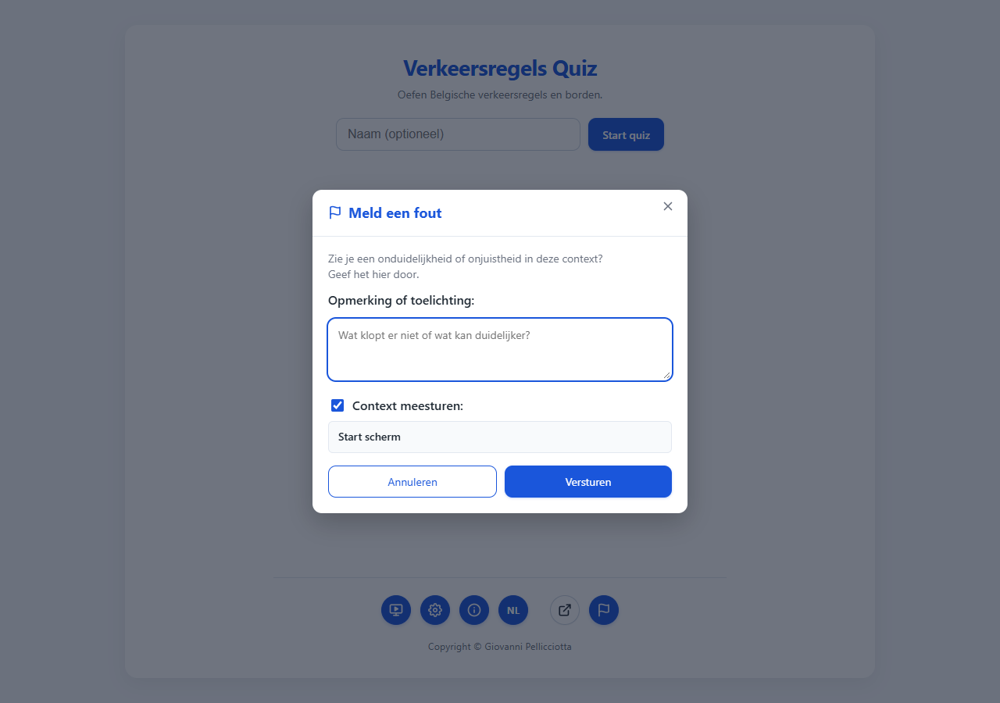
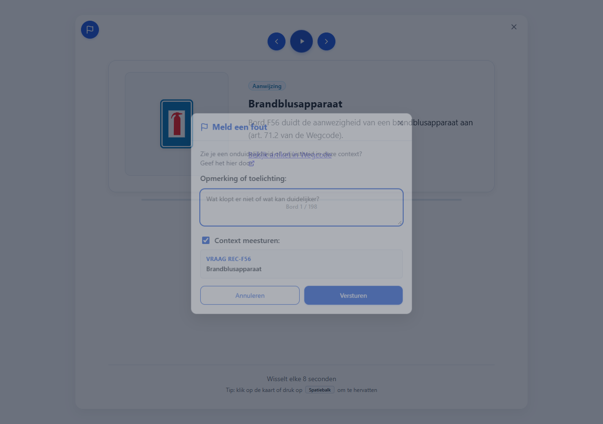
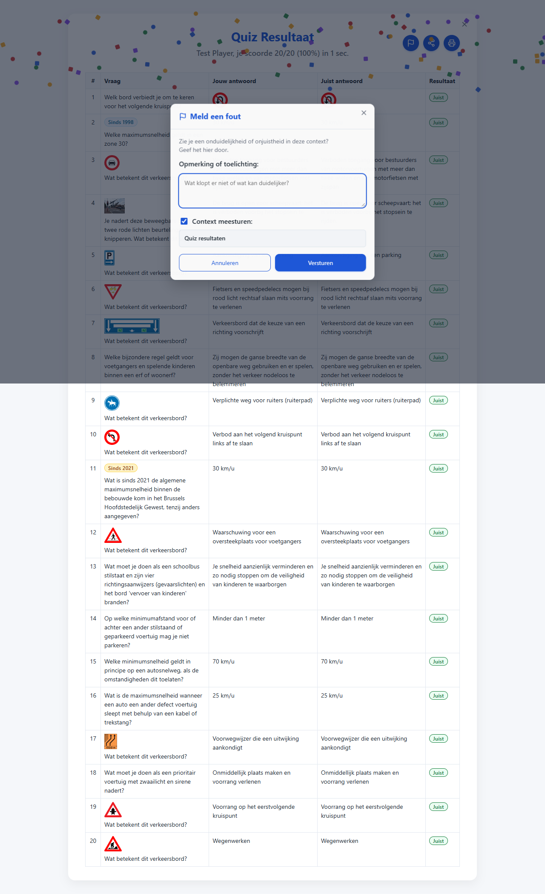
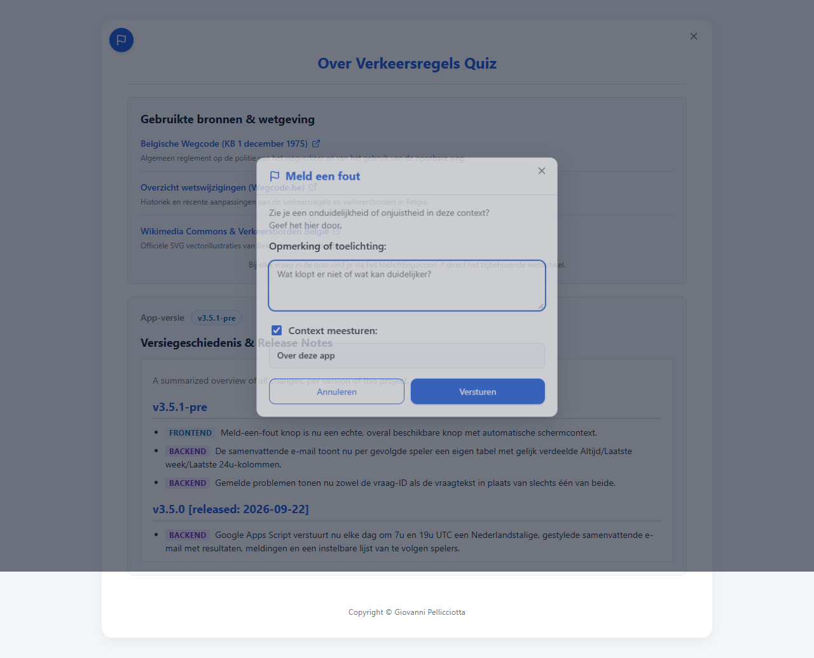
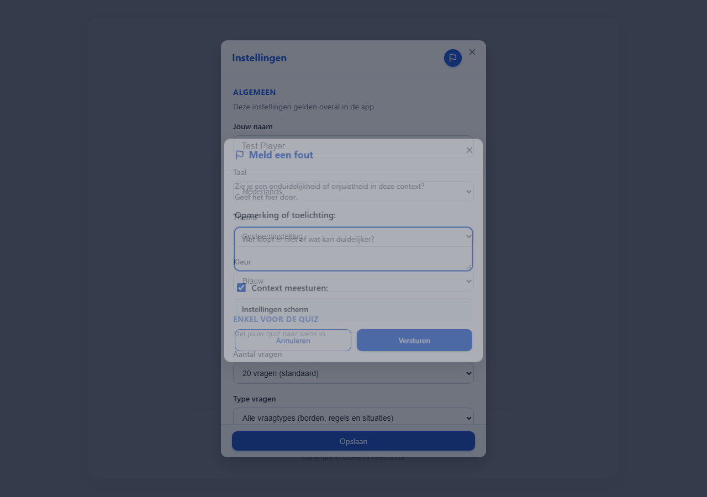

# T0069: Change the Report Issue Circular Info Button on the Start Screen

## Goals
Turn the start screen's decorative "report" hint icon into a real, clickable
"Report issue" button, and add an equivalent report button to every other
screen and the settings modal so an issue can be reported from anywhere.
Generalize the report modal's default context per screen: the current quiz
question, the currently shown carrousel sign, or the view's name (e.g.
"Quiz resultaten", "Start scherm", "Instellingen scherm") for all other
views. Keep the existing quiz-screen report buttons and Google Sheet payload
shape unchanged.

## Task Execution Steps
- [x] **[Read]**      Inspect report-modal.js, report-queue.js, dom.js, screens.js, and all screen markup/CSS.
- [x] **[Implement]** Convert the start screen hint icon into a real report button.
- [x] **[Implement]** Add report buttons to result, carousel, about screens and the settings modal.
- [x] **[Implement]** Generalize report context resolution (question / sign / view name) in report-modal.js.
- [x] **[Implement]** Add i18n strings across all five languages.
- [x] **[Verify]**    Run the Python test suite and a Playwright browser check with before/after screenshots.
- [x] **[Doc]**       Record validation results and screenshots in this task file.

## Execution Log
- [2026-09-22] **[Decided]**
  Claimed T0069. Keep the existing per-question quiz report buttons unchanged; add matching
  round report buttons to start/result/carousel/about/settings, all sharing one context resolver.

- [2026-09-23] **[Verify]**
  Ran `python -m pytest tests/ -q`: 128 passed, 8 subtests passed, no regressions.
  - Regenerated translated `CHANGELOG.{en,fr,de,it}.md` via `translate-markdown.py generate --all`.
  - Ran `tests/report-issue-browser.cjs --screenshots` against a local server (HTTP 200).
  - Report button reachable and correctly contextualized on all six entry points.

- [2026-09-23] **[Doc]**
  Recorded validation results, screenshots, review tier, and a devops.md section for the new
  browser check in this task file.

- [2026-09-23] **[Complete]**
  Delivered a real, reachable "Report issue" button on every screen and the settings modal,
  each defaulting to the correct per-screen context.

## Walkthrough & Validation

### Changes Made
- `index.html`: replaced the start screen's decorative hint `` with a real `<button
  id="btn-report-start">`; added matching round report buttons `#btn-report-about`,
  `#btn-report-result`, `#btn-report-carousel`, and `#btn-report-config` (in the settings
  modal header) reusing the existing round-icon-button styles.
- `js/dom.js`: added element references for the five new report buttons.
- `js/app.js`: wired each new button's click handler to the existing `openReportModal`.
- `js/report-modal.js`: added `getReportContext()`, which inspects which screen/modal is
  currently visible (settings modal takes priority, then carousel, quiz, result, about, else
  start) and returns `{ id, text }` — the current question, the current carrousel sign, or the
  view's i18n name. `openReportModal` captures this into `currentReportContext` and shows/hides
  the question-id prefix accordingly; `handleReportSubmit` forwards the captured context instead
  of reading `state.round[state.currentIndex]` directly.
- `js/report-queue.js`: `submitErrorReport` now takes a generic `context` (`{ id, text }`)
  instead of a quiz question object; the Google Sheet payload shape (`vraagId`, `vraag`, etc.)
  is unchanged.
- `data/strings.{nl,en,de,fr,it}.json`: added `report.btn_generic_aria`/`_tooltip` and the five
  `report.view_*` view-name strings ("Start scherm", "Instellingen scherm", "Quiz resultaten",
  "Over deze app", the carousel fallback).
- `css/style.css`: added `.start-meta-btn-action`, `.btn-report-round` (+ `-sm` variant), and
  `.modal-header-actions` styles so the new buttons match the existing round icon buttons.
- `tests/test_about_view.py`: updated the start-screen markup assertions for the new button.
- `tests/report-issue-browser.cjs` (new): Playwright regression test exercising the report
  button and its default context on all six entry points.

### Visual Validation
Served locally with `python -m http.server` (HTTP 200 confirmed) and driven by Playwright at
1280x900:
- Start screen: the old plain decorative flag hint is now a solid-blue clickable button; opening
  it shows "Start scherm" as context with no question-id prefix.
- Quiz screen: existing per-question report button unchanged, still shows the question and a
  "Vraag ..." id prefix.
- Carousel: report button opens with the current sign's title as context.
- Result screen: opens with "Quiz resultaten" as context.
- About screen: opens with "Over deze app" as context.
- Settings modal: report button opens the report modal on top, with "Instellingen scherm" as
  context; the settings modal stays open underneath and closing the report modal doesn't close it.

### Automated Checks
- `python -m pytest tests/ -q`: 128 passed, 8 subtests passed.
- `node tests/report-issue-browser.cjs --screenshots`: PASS, no browser console errors, all six
  context assertions correct.

### Review Tier
Solo AI agent, pre-authorized autonomous-loop integration: implementation, tests, and visual
verification all passed, so this task integrates directly per the coordination protocol.
