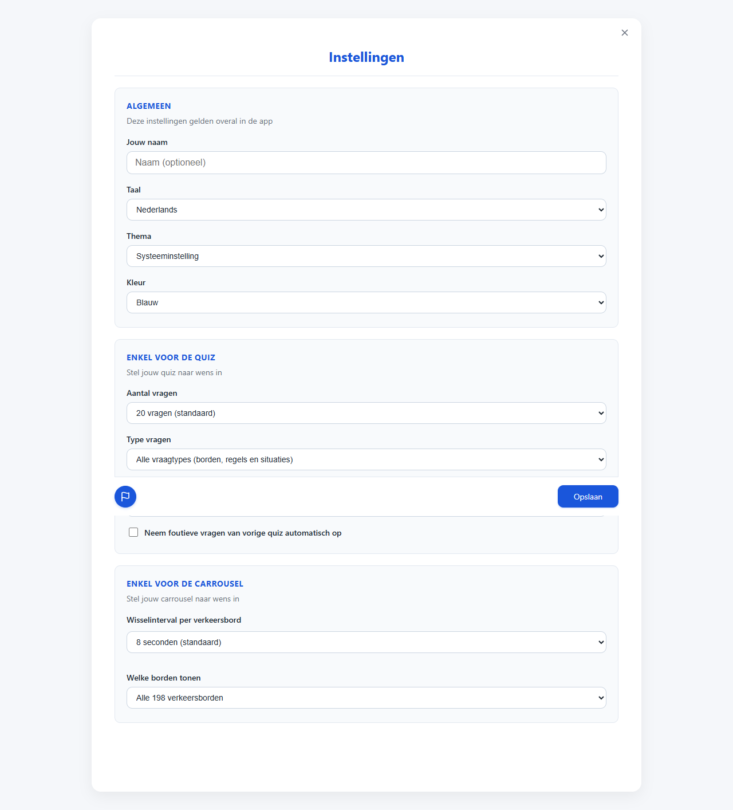
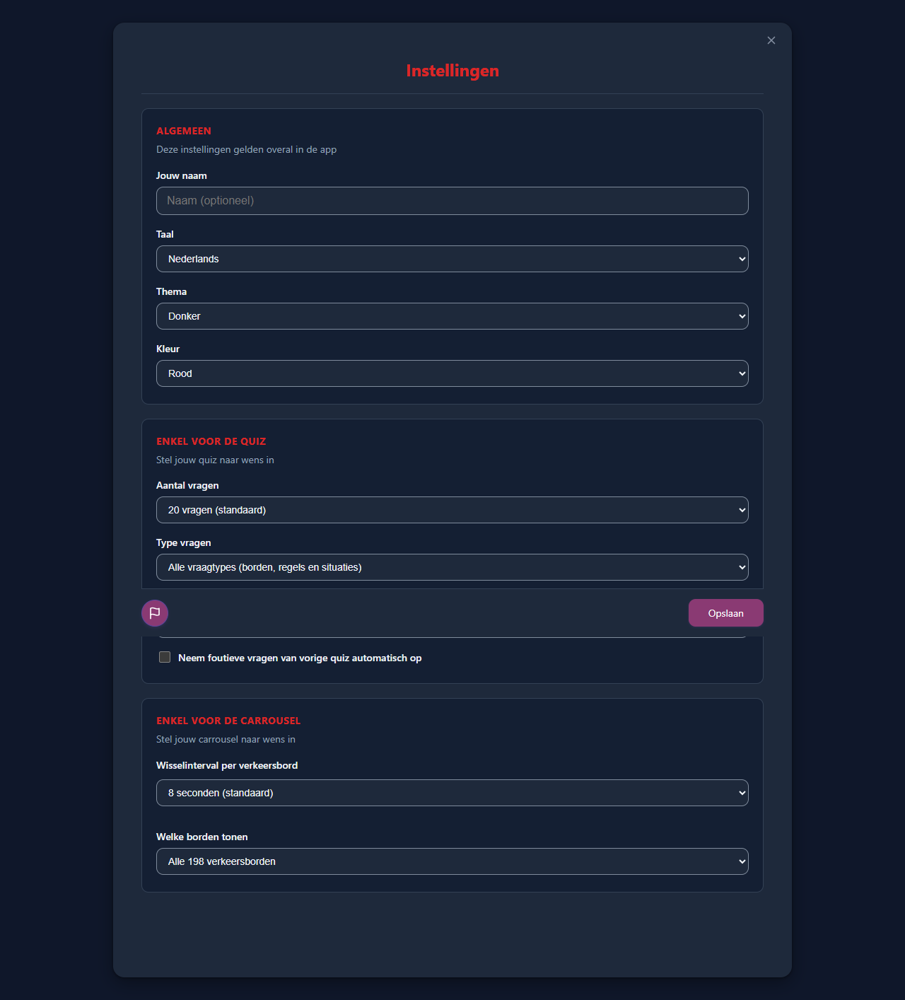
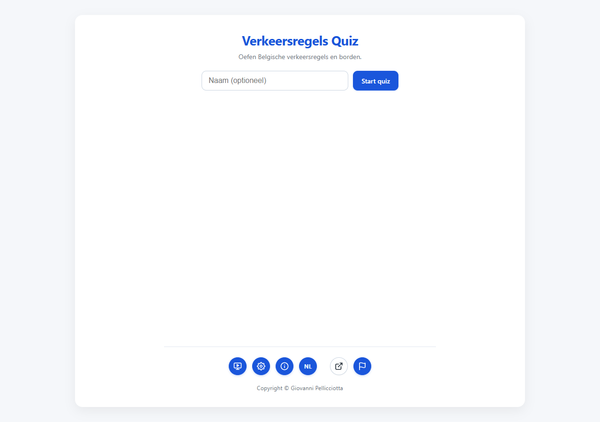
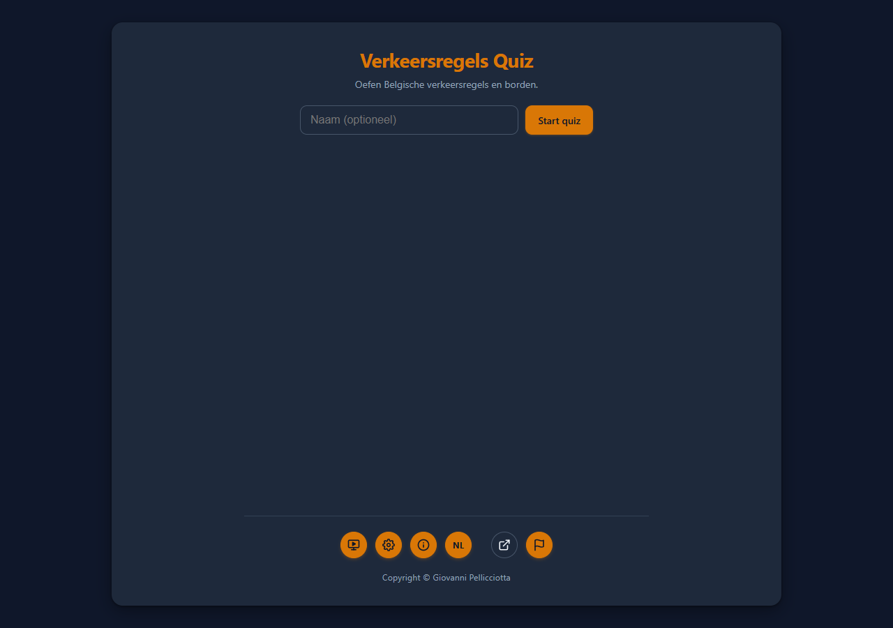

# T0073: Immediate Theme Preview in Settings with Revert on Dismissal

## Goals
Enable instantaneous visual previews when selecting theme or accent color options in the Settings view.
Track the initial theme and color configurations upon opening the settings dialog.
Revert changes to the initial configuration when the settings view is closed via the close button or Escape key.
Persist and retain theme changes when the user clicks the save button.
Provide comprehensive automated browser and unit testing with visual before and after screenshots.

## Task Execution Steps
- [x] **[Read]**      Inspect current settings view and theme application logic in `js/config-view.js` and `js/theme.js`.
- [x] **[Decide]**    Determine theme preview and revert strategy for dismissal versus persistence on save.
- [x] **[Implement]** Add change event listeners for instant theme preview in settings.
- [x] **[Implement]** Store initial theme states on open and revert on dismissal in `js/config-view.js`.
- [x] **[Verify]**    Implement automated unit and browser tests and capture visual verification screenshots.
- [x] **[Doc]**       Update requirements documentation, specifications, task logs, and changelog.

## Execution Log
- [2026-09-23] **[Read]**
  Inspected `js/config-view.js`, `js/app.js`, `js/theme.js`, and existing automated test suites.

- [2026-09-23] **[Decide]**
  Tracked initial theme and accent color on open, applied changes on selection, and reverted on dismissal.

- [2026-09-23] **[Implement]**
  Added `previewTheme` change listeners to theme selects, stored initial values, and reverted in `closeConfigView`.

- [2026-09-23] **[Verify]**
  Added unit tests in `test_theme_and_color.py` and real browser tests in `theme-preview-browser.cjs`.

- [2026-09-23] **[Doc]**
  Updated `docs/requirements.md` and added release note entry in `CHANGELOG.md`.

- [2026-09-23] **[Complete]**
  Completed instant theme and color preview in settings with full dismissal revert and save persistence.

## Walkthrough & Validation

### Changes Made
- `js/config-view.js`: added `previewTheme` function, recorded `initialThemeSetting` and `initialThemeColor` on `openConfigView`, reverted them in `closeConfigView`, and updated them on `saveConfig`.
- `js/app.js`: wired `previewTheme` to `change` events on `el.configTheme` and `el.configThemeColor`, and exposed `previewTheme` on `window`.
- `tests/test_theme_and_color.py`: added unit test cases validating `previewTheme`, event listener bindings, and initial state revert.
- `tests/theme-preview-browser.cjs`: automated end-to-end browser verification of instant preview, close button revert, escape key revert, save persistence, and visual captures.
- `docs/requirements.md`: documented settings view instant theme preview and dismissal revert requirements.
- `CHANGELOG.md`: documented deliverable under `v3.5.1-pre`.

### Visual Validation
- Baseline Start Screen: 
- Settings Modal: 
- Instant Dark + Red Preview: 
- Reverted Start Screen: 
- Saved Dark + Yellow Screen: 

### Test Verification
- All 157 pytest tests passed (`pytest` exited with code 0).
- Playwright browser test suite `tests/theme-preview-browser.cjs` passed with 0 page errors.
