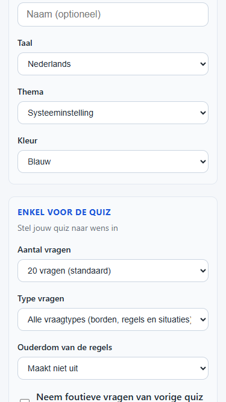
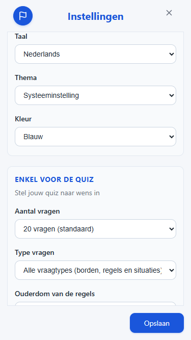

# T0075: Sticky Action Buttons on Mobile and Desktop Save Button

## Goals
Make action buttons sticky so they never scroll off screen.
In mobile view, keep action buttons accessible during scrolling across all screens and dialogs.
In desktop view, ensure the settings save button remains sticky at the bottom.
Maintain clean spacing, seamless theme styling, and full accessibility across viewports.

## Task Execution Steps
- [x] **[Read]**      Inspect styling across config, result, quiz, modals, and start screens.
- [x] **[Decide]**    Determine sticky positioning rules for mobile action buttons and desktop save button.
- [x] **[Implement]** Apply sticky styling to config actions, modal actions, and mobile action bars.
- [x] **[Verify]**    Validate layout visually in mobile and desktop viewports using automated browser tests.
- [x] **[Doc]**       Update documentation and changelog files across all supported languages.

## Execution Log
- [2026-09-23] **[Decided]**
  Pin the settings save button sticky at the viewport bottom on both mobile and desktop.
  Make mobile action rows, modal footers, and header controls sticky to prevent scrolling off screen.

- [2026-09-23] **[Implement]**
  Updated `css/style.css` to position `.config-actions` sticky at the bottom with theme-aware background.
  Added sticky positioning to `.modal-actions`, `.result-header`, `.about-header`, `.config-header`, `.carousel-header`, and `.start-bottom-meta`.

- [2026-09-23] **[Verify]**
  Captured baseline and updated screenshots across mobile (375x667) and desktop (1024x650) viewports.
  Ran unit and browser test suites with 151 automated tests passing.
  - Baseline screenshot: 
  - Updated screenshot: 

- [2026-09-23] **[Doc]**
  Updated `CHANGELOG.md` in Dutch, English, French, German, and Italian.
  Updated `docs/requirements.md` with sticky action button specifications.

- [2026-09-23] **[Complete]**
  Delivered sticky action buttons across mobile and desktop views with full automated test coverage.
