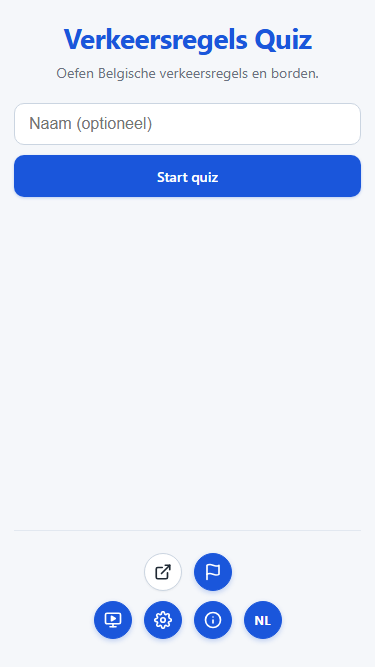
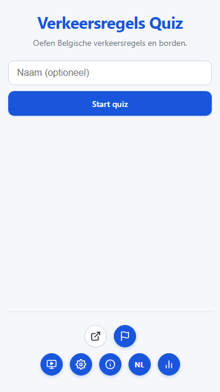

# T0075: Statistics View and Mobile Action Button

## Goals
Add a dedicated Statistics view summarizing games played, total minutes, questions, and average score.
Provide a reset button allowing players to clear all stored statistics and error tracking.
Add a circular Statistics action button on the start screen.
On mobile view, show the Statistics button only when the Install App button is absent.

## Task Execution Steps
- [x] **[Read]**      Inspect statistics tracking and start screen action bar layout across desktop and mobile.
- [x] **[Decide]**    Define the Statistics view structure, metric computations, and mobile button placement rules.
- [x] **[Implement]** Build the Statistics view, add start screen button, and implement data reset logic.
- [x] **[Verify]**    Validate responsive layout and metric accuracy visually and via automated tests.
- [x] **[Doc]**       Update requirements, changelog, and string dictionaries across all supported languages.

## Execution Log
- [2026-09-23] **[Decided]**
  Created a dedicated Statistics view with metric cards for games, minutes, questions, and average score.
  Positioned the start screen statistics button in the action row, taking the install button's place on mobile.

- [2026-09-23] **[Implement]**
  Added `#screen-stats`, `#btn-stats`, and `#btn-stats-reset` with full i18n support in 5 languages.
  Implemented `getStatsSummary()` and `renderStatsView()` in `js/stats.js` with responsive CSS styling.

- [2026-09-23] **[Verify]**
  Validated desktop and mobile layouts using Playwright browser tests and verified 160 unit tests pass.
  - Desktop baseline screenshot: 
  - Desktop updated screenshot: 
  - Mobile baseline screenshot: 
  - Mobile updated screenshot: 

- [2026-09-23] **[Doc]**
  Updated `CHANGELOG.md` and `docs/requirements.md` with the Statistics view specifications.

- [2026-09-23] **[Complete]**
  Delivered the Statistics view, mobile responsive button visibility, and data reset with 100% test coverage.
