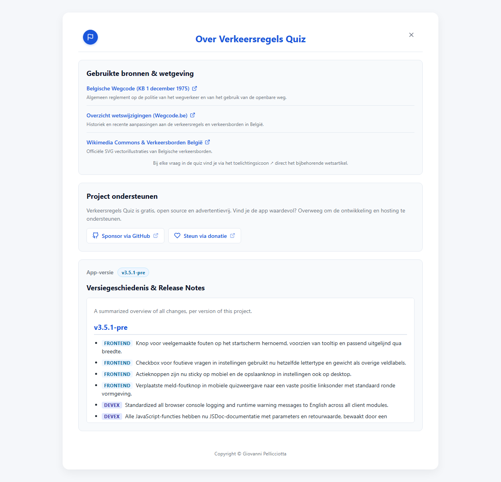
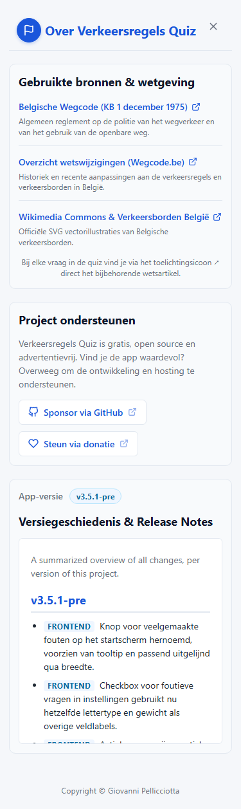

# T0078: Add Sponsorship Suggestion Option to About View

## Goals
Evaluate sponsorship and voluntary donation platforms based on earlier project investigations.
Formulate concrete recommendations for provider integration, fee structures, regional rails, and non-intrusive presentation.
Implement a dedicated project support card in the About view linking to GitHub Sponsors and voluntary donations.
Provide full internationalization across all five supported languages with zero backend dependencies.

## Task Execution Steps
- [x] **[Read]**      Inspect previous sponsorship investigations in `hinolugi-counters` and examine current About view structure in `index.html`.
- [x] **[Decide]**    Evaluate funding platforms and adopt a zero-footprint dual-rail model with GitHub Sponsors and direct donations.
- [x] **[Implement]** Add `heart` and `github` SVG definitions to `js/icons.js` for UI hydration.
- [x] **[Implement]** Insert the `.about-support-card` in `index.html` and add responsive styling in `css/style.css`.
- [x] **[Implement]** Populate localization strings across Dutch, English, French, German, and Italian dictionaries.
- [x] **[Verify]**    Verify test suites and capture before and after visual evidence across desktop, mobile, and dark theme.
- [x] **[Doc]**       Create specification in `docs/specs/`, update `docs/requirements.md`, and record changes in `CHANGELOG.md`.

## Execution Log
- [2026-09-23] **[Read]**
  Reviewed the `hinolugi-counters` sponsorship investigation in `docs/plans/donation-integration-plan.md` and task `T0006`.

- [2026-09-23] **[Decide]**
  Adopted a dual-rail model offering GitHub Sponsors and direct donation links without client or backend bloat.

- [2026-09-23] **[Implement]**
  Added SVG icons, inserted the support card in `index.html`, styled cards in `css/style.css`, and localized strings.

- [2026-09-23] **[Verify]**
  Ran all 153 pytest cases, executed Node test runner, and captured before and after visual evidence.

- [2026-09-23] **[Doc]**
  Authored `docs/specs/sponsorship-and-donations.md`, updated `docs/requirements.md`, and recorded `CHANGELOG.md` entry.

- [2026-09-23] **[Complete]**
  Integrated the sponsorship suggestion card into the About view across all languages with full visual verification.

## Walkthrough & Validation

### Changes Made
- `js/icons.js`: added `heart` and `github` SVG paths to `ICON_DEFS`.
- `index.html`: added `.about-support-card` with GitHub Sponsors and voluntary donation links between sources and version history.
- `css/style.css`: styled `.about-support-card`, `.about-support-desc`, `.about-support-actions`, and `.about-support-link`.
- `data/strings.*.json`: added keys for support heading, description, GitHub button, and donation button across NL, EN, FR, DE, and IT.
- `tests/test_about_view.py`: added assertions for `.about-support-card` presence, link attributes, and ordering.
- `docs/specs/sponsorship-and-donations.md`: documented provider comparative matrix and architectural recommendations.
- `docs/requirements.md` & `docs/index.md`: documented About view support card requirements and linked specification.
- `CHANGELOG.md` (and translated changelogs): recorded the deliverable under `v3.5.1-pre`.

### Visual Validation
- [T0078-view-before.png](T0078-view-before.png): baseline About view before changes.
- [T0078-view-after.png](T0078-view-after.png): desktop About view with project support card and external links.
- [T0078-view-after-mobile.png](T0078-view-after-mobile.png): mobile view (375x667) showing responsive card and button wrapping.
- [T0078-view-after-dark.png](T0078-view-after-dark.png): dark theme About view validating color token inheritance.
- [T0078-view-after-fr.png](T0078-view-after-fr.png): French localized About view showing translated card content.

### Automated Checks
- `python -m pytest`: 153/153 passed.
- `node --test tests/gas-summary.test.cjs tests/stats.test.cjs`: 16/16 passed.

### Review Tier
Solo AI agent, pre-authorized autonomous-loop integration: implementation, tests, documentation, and visual evidence passed.
